# INFORME TP1 - GRUPO InfinityLAN

### INTEGRANTES:

* Reyeros, Marcos Agustín
* Brezzo, Benjamin
* Castillo, Dario

## Consigna 1

Repasar y resumir brevemente los fundamentos básicos y esenciales al respecto de: Ondas
Electromagnéticas, Modulación/Demodulación, Señales de tiempo continuo, Señales de tiempo discreto,
y luego responder las consignas a continuación:

---

#### a) Analizar el siguiente gráfico de una onda electromagnética:

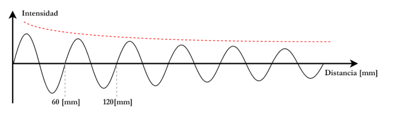

### RESPUESTA:

El gráfico muestra una onda electromagnética representada como una señal periódica que varía su intensidad con respecto a la distancia. Se puede observar que la onda mantiene un patrón repetitivo a lo largo del eje horizontal, lo cual indica que posee una frecuencia constante. La distancia entre dos picos sucesivos es de aproximadamente 60 mm, lo que nos da una idea de su longitud de onda.

Además, se incluye una línea de trazos rojos que actúa como una envolvente decreciente, la cual representa cómo la amplitud de la onda disminuye a medida que avanza en el espacio. Este comportamiento es característico de un fenómeno conocido como atenuación, donde la energía de la onda disminuye con la distancia recorrida.

En resumen, el gráfico representa una onda electromagnética que se propaga en el espacio, con una intensidad que disminuye gradualmente debido a un proceso físico que afecta su amplitud, manteniendo sin embargo una periodicidad clara.

---

#### b) ¿Qué frecuencia y longitud de onda tiene esta onda?. Considerar que viaja exactamente a la velocidad de la luz (C).

### RESPUESTA

En el gráfico se observa que la longitud de onda de la onda electromagnética es de **60 mm**, ya que esa es la distancia entre dos picos consecutivos.

Sabemos que la **velocidad de la luz (c) en el vacío** es:

```bash
    c = 299.792.458 m/s
```
Para calcular la **frecuencia (f)** de la onda, utilizamos la fórmula:

```bash
    f = c / λ
```

Donde:

+ f es la frecuencia,

+ c es la velocidad de la luz,

+ λ es la longitud de onda.

Convirtiendo 60 mm a metros:

```bash
    λ = 60 mm = 0,06 m
```

```bash
    f = 299.792.458 m/s / 0,06 m ≈ 4.996.541.000 Hz ≈ 5 GHz
```

+ **Longitud de onda (λ): 60 mm**

+ **Frecuencia (f): 4,99 GHz**
---
#### c) El espectro EM está dividido en regiones y bandas. Investigar y mencionar en qué región del espectro opera esta onda, y más precisamente, en qué banda. Podés utilizar las definiciones de la ITU.

### RESPUESTA

Dado que la frecuencia calculada en el punto anterior es de aproximadamente 5 GHz, podemos ubicar esta onda dentro del espectro de microondas, una subregión del espectro electromagnético.

Según las definiciones establecidas por la Unión Internacional de Telecomunicaciones (UIT / ITU), el espectro se divide en bandas de frecuencia. La frecuencia de 5 GHz corresponde a la siguiente clasificación:

+ Región del espectro: Microondas

+ Banda según ITU: SHF (Super High Frequency)

+ Rango de la banda SHF: de 3 GHz a 30 GHz

La banda SHF es ampliamente utilizada en tecnologías de comunicación inalámbrica, como WiFi, radares, enlaces satelitales y sistemas de microondas punto a punto.

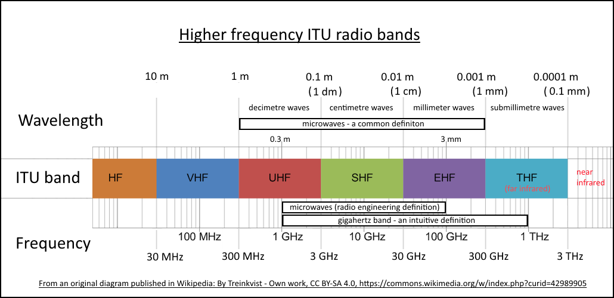

---

#### d) Investigar qué dispositivos para comunicaciones de datos operan en esta banda y brindar al menos un ejemplo.

La banda **SHF** (Super High Frequency), que abarca de **3 GHz a 30 GHz**, es ampliamente utilizada para múltiples tecnologías de comunicación inalámbrica de alta velocidad y corta o media distancia.

Dispositivos que operan en esta banda:

+ Routers WiFi de 5 GHz (estándar IEEE 802.11ac/ax)

+ Enlaces de microondas punto a punto

+ Sistemas de radar

+ Equipos de comunicación satelital

+ Tecnología WiMAX

+ Dispositivos de redes 5G (banda baja y media)

Ejemplo:

Un router doméstico que utiliza WiFi de 5 GHz, como el modelo TP-Link Archer C6 o cualquier router con estándar 802.11ac, opera en esta banda para ofrecer mayores velocidades de transferencia y menos interferencia que la banda de 2.4 GHz.

Estos dispositivos se benefician de la capacidad de la banda SHF para transmitir grandes volúmenes de datos, aunque con un alcance más limitado y mayor sensibilidad a obstáculos físicos en comparación con frecuencias más bajas.

--- 

#### e) ¿Qué fenómeno se quiere representar con la línea de trazos roja en la figura de la onda?

### RESPUESTA

La línea de trazos rojos que aparece superpuesta en el gráfico de la onda representa el fenómeno de la atenuación.

La atenuación es la disminución progresiva de la amplitud (o intensidad) de una señal a medida que se propaga por el espacio o a través de un medio. En el caso de una onda electromagnética, esta pérdida de energía puede deberse a varios factores, como:

+ Absorción por el medio (aire, paredes, humedad)

+ Dispersión o difracción alrededor de objetos

+ Interferencias con otras señales

+ Reflexiones que desvían parte de la energía

---

#### f) El fenómeno descrito en el ítem anterior, ¿Afecta al dispositivo que diste de ejemplo? ¿Podés notar esto en alguna experiencia de la vida cotidiana?

### RESPUESTA

Sí, el fenómeno de atenuación afecta directamente al router WiFi de 5 GHz, que fue el dispositivo mencionado como ejemplo en el punto anterior.

La banda de 5 GHz, aunque permite velocidades más altas y menor congestión que la de 2.4 GHz, tiene una mayor atenuación. Esto significa que:

+ La señal pierde intensidad más rápidamente con la distancia.

+ Es más sensible a obstáculos físicos como paredes, techos o muebles.

Una situación común es cuando el router está en una habitación y uno se aleja o cambia de ambiente. Si el dispositivo (como un celular o notebook) está conectado a la red WiFi de 5 GHz, es frecuente que se pierda señal rápidamente al alejarse.

La conexión se vuelva inestable o se caiga, especialmente si hay paredes gruesas de por medio.

El dispositivo cambia automáticamente a la red de 2.4 GHz, que tiene más alcance pero menor velocidad.

Esto demuestra cómo la atenuación impacta el funcionamiento real de los dispositivos que operan en la banda SHF.

---

#### g) El fenómeno descrito anteriormente:
+ i) ¿Afecta a las transmisiones de telefonía celular?
+ ii) ¿Afecta a las transmisiones por cable coaxial?
+ iii) ¿Afecta a las transmisiones por fibra óptica?

### RESPUESTA

**i) ¿Afecta a las transmisiones de telefonía celular?**

Sí. Las señales de telefonía celular también se ven afectadas por la atenuación, especialmente en frecuencias más altas como las utilizadas en redes 4G y 5G.
En zonas con muchos edificios o al estar dentro de estructuras cerradas, es común que la señal se debilite o incluso se pierda. Por eso, las operadoras instalan antenas repetidoras en áreas urbanas densas para compensar esa pérdida de señal.

**ii) ¿Afecta a las transmisiones por cable coaxial?**

Sí, pero en menor medida. Aunque los cables coaxiales son diseñados para reducir la atenuación, también sufren pérdidas de señal, especialmente a medida que aumenta la distancia.
Por eso, en instalaciones largas (como en televisión por cable o redes), se utilizan amplificadores o repetidores para mantener la calidad de la señal.

**iii) ¿Afecta a las transmisiones por fibra óptica?**

Sí, pero en muchísima menor medida. La fibra óptica tiene una atenuación extremadamente baja en comparación con los medios eléctricos o inalámbricos.
Esto permite transmitir datos a largas distancias con muy poca pérdida, lo cual la hace ideal para redes troncales de internet y telecomunicaciones. Aun así, en tramos muy extensos se colocan amplificadores ópticos (como los EDFA) para mantener la señal.


# 2)
## a) 
   Se representa un ***trasmision serie sincrona***. por una sola linea se transmite datos en una sola direccion.
Es sincrono porque la comunicacion depende del pulso de relog compartido entre el receptor y transmisor.

Al ser una sola linea de datos se denomina transmision half duplex
Como no sabemos si la lectura es por flanco de subida o flanco de bajada deducimos que si es de bajada son cmunicaicones ***I2C*** en ambas direcciones , si es ***usart*** es una comunicacion asincrona.
Ninguna correspnde con nuestra grafica.
Por lo cual la comunicacion es ***SPI*** porque hay una linea de clock separada y se lee por flanco de subida.

Viendo la imagen podemos ver que el mensaje es el binario 
```plaintext
1 0 0 1 1 1 1 0 
```
de acuerdo a la imagen :

> 

> **Figura 1:** transmision sincrona.
## b) 
la ventaja de esta transmision es que el mensaje esta sincronizado y el receptor sabe ***cuando leer cada bits***.

Pero ***no seria el mejor paradigma*** ya que la transmision  y recepcion estan compartidas por la misma linea. deberia tener una linea extra para la recepcion. 

## c)
El grafico correcponde a una comunicacion UART, donde el reloj del transmisor no depende del reloj del receptor. 

Estas transmisiones se cominican de acuerdo a un bit de star '1' logico que indica el comienzo de la transmision, luego de 8 ciclos de reloj(de acuerdo al mensaje si es de 1 byte) y un bit de parada '1' logico que determina el fin del mensaje. 

En la omagen podemos ver el mensaje '0 0 1 0 0 0 1 1', omite los bits de inicio y parada. Ese mensjae es el 35 en ascii que corresponde al signo numeral '#'
cada bits es interpretado de acuerdo al valor central del ciclo de reloj del clock del transmisor con el valor que tiene el mensaje en ese momento.

Para transmitir la letra 'i' que es la 4ta letra de nuestro nombre, debemos buscar la tabla ascii de dicha letra.


para pasar el 105 a binario:
```plaintext
    i = ascii = 105 
```
 
Para pasar el 105 a binario:

>   
> **Figura 2:** Conversión paso a paso de ASCII 105 a binario para la letra `'i'`.
por lo tanto el mensaje seria : 
```plaintext
' 0 1 1 0 1 0 0 1'
```
la señal se veria asi:


>   
> **Figura 3:** transmision letra `'i'`.
## d)
Se miden en la mitad del ciclo del reloj.

No se debe medir en los flancos ya que la señal esta cambiando de un estado a otro.


## 3. Transmitir una señal escalonada de forma inalámbrica
Transmitir una señal escalonada de forma inalámbrica puede ser muy problemático, ya que esta cambia bruscamente 
de un valor a otro, lo cual representa un salto instantáneo en el dominio del tiempo y esto implica que en 
dominio de la frecuencia tiene infinitos armónicos, es decir, muchas frecuencias muy altas. De lo estudiado en
la teoría de la Transformada de Fourier sabemos que **cuanto más abrupta es la transición en el tiempo, más ancho
es su espectro en frecuencia**.
Por lo tanto, para reproducir una transición instantánea se necesita transmitir a frecuencias muy altas, y en 
la práctica los sistemas inalámbricos tienen un ancho de banda limitado lo que hace que la señal se suavice y deje
de ser un escalón perfecto (se redondean sus bordes), además en los canales inalámbricos las frecuencias altas se atenúan más que la bajas, esto significa que las transiciones rápidas se pierden o se retrasan, deformando la señal.
Otra cuestión a tener en cuenta considerando que el espectro en frecuencia ocupa mucho más espacio es que es 
más propensa a interferir con otros canales. Y como su energía se reparte en muchas frecuencias, cada parte se ve más afectada por el ruido.

**a)** 


La modulación observada en la imagen es Phase Shift Keying. Esta es una técnica donde la fase de una portadora
sinusoidal cambia para representar datos digitales (bits).

**b)**
Señal digital modulada:


**c)**
Las principales técnica de modulación para datos digitales son:
- Modulación por Desplazamiento de Amplitud (_ASK_)
- Modulación por Desplazamiento de Frecuencia (_FSK_)
- Modulación por Desplazamiento de Fase (_PSK_)
También existen técnicas más avanzadas como:
- Quadrature Amplitud Modulation (_QAM_)
- Quadrature Phase Shift Keying (_QPSK_)
- M-ary PSK

**d)**
El **BER** (Bit Error Rate o Tasa de Error de bit) es la fracción de bits transmitidos que llegan con error
respecto al total enviado.
Se calcula de la siguiente manera:
$$ BER = \frac{Número de bits erroneos}{Número de bits transmitidos} $$
Entre las técnicas de modulación mencionadas, la que mejor resultados tiene es la PSK.


## 4. Implementación de red simple en Cisco Packet Tracer
**a)**


**b)**
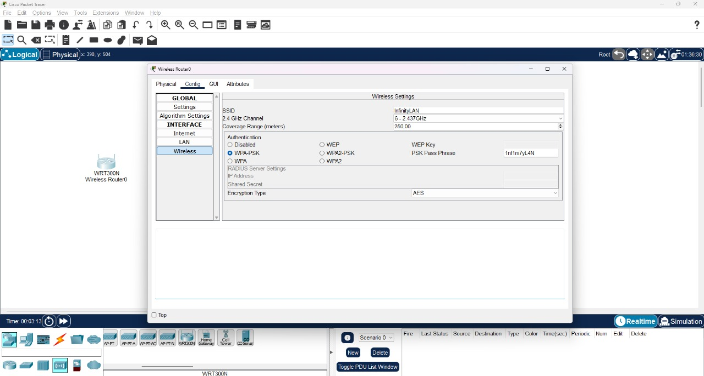

**c)**

El router inalámbrico opera en la frecuencia de **2.4GHz**, por lo tanto transmite en la región de microondas del espectro electromagnético.
El rango asignado es 2.400 GHz - 2.438GHz, dentro de este rango el espectro se divide en canales de 22MHz de ancho de banda (aunque se suele separar de a 5 MHz).

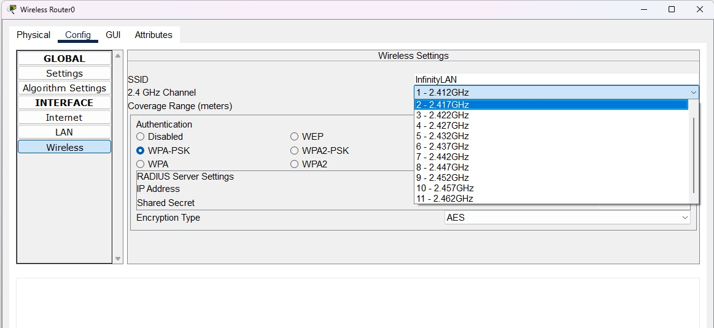

En la imagen podemos ver: 
- Canal 1 -> **2.412 GHz** (frecuencia central)
- Canal 6 -> **2.437 GHz**
- Canal 11 -> **2.462 GHz**

**d)**

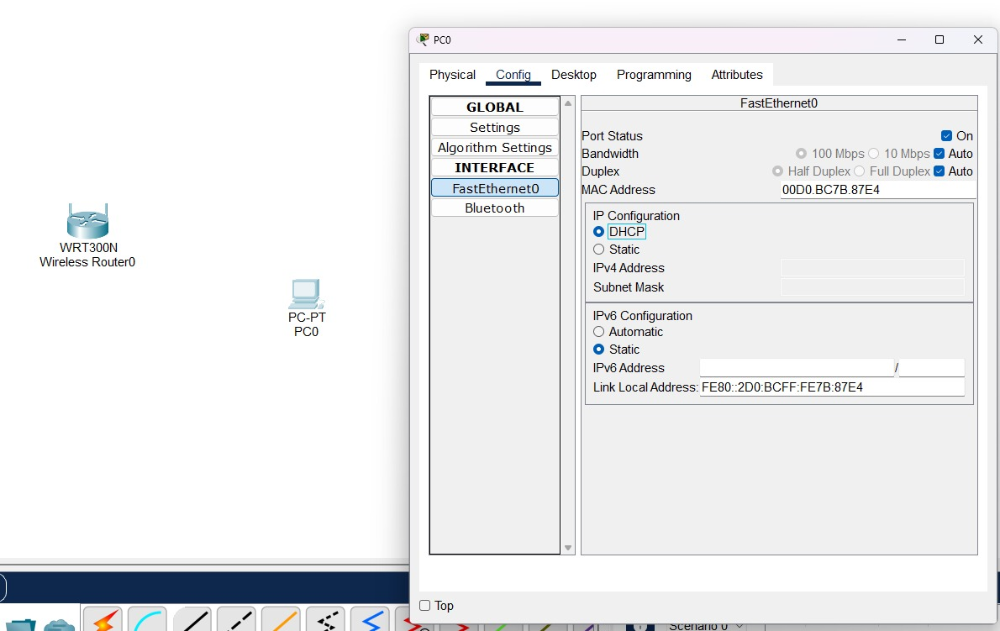

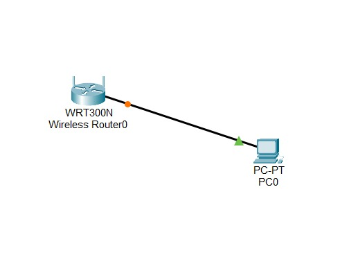

**e)**

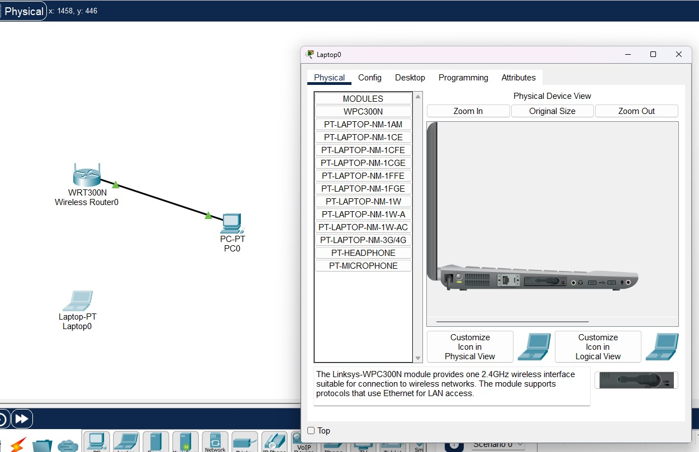

**f)**

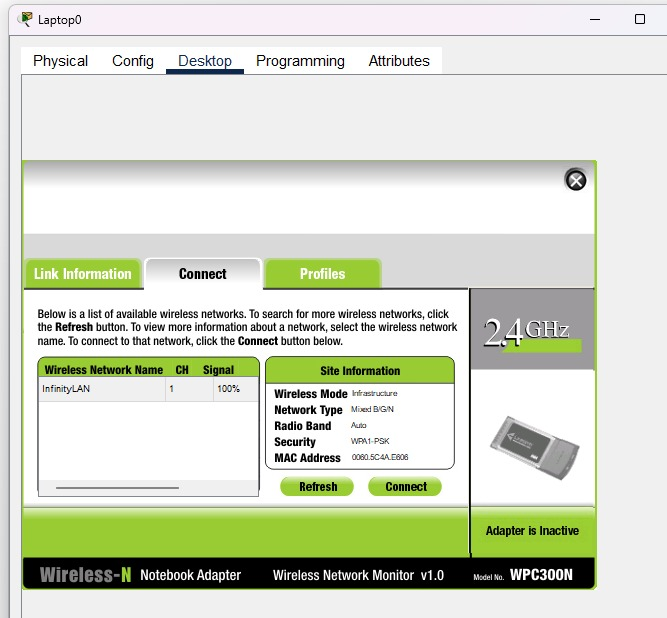

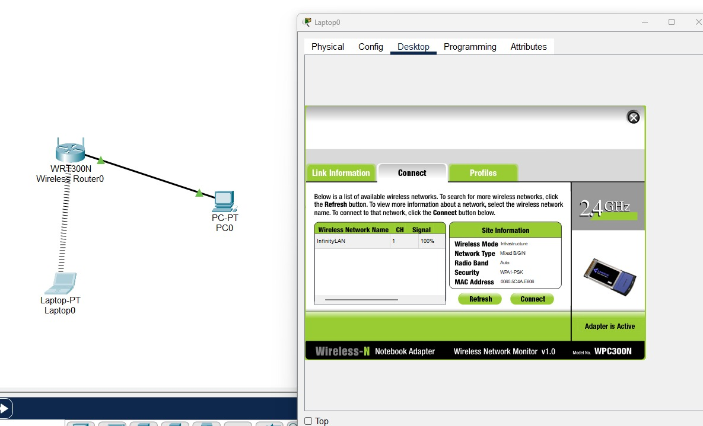

**g)**

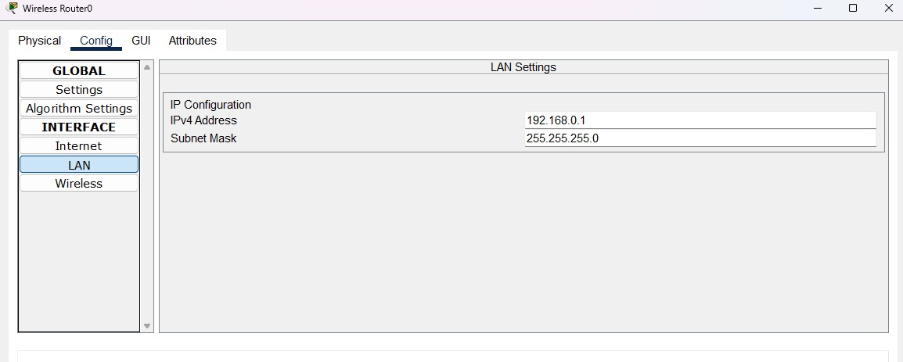
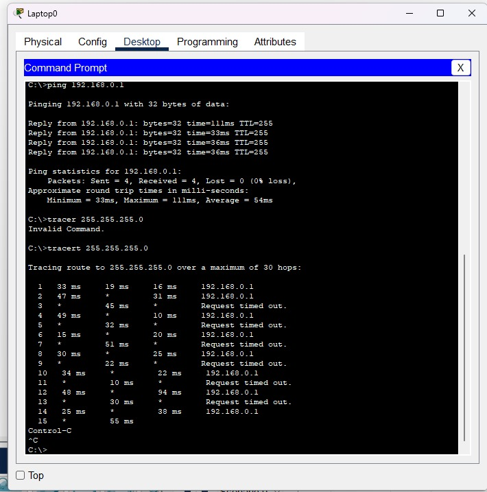
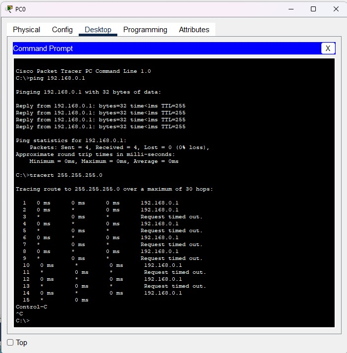

**h)**

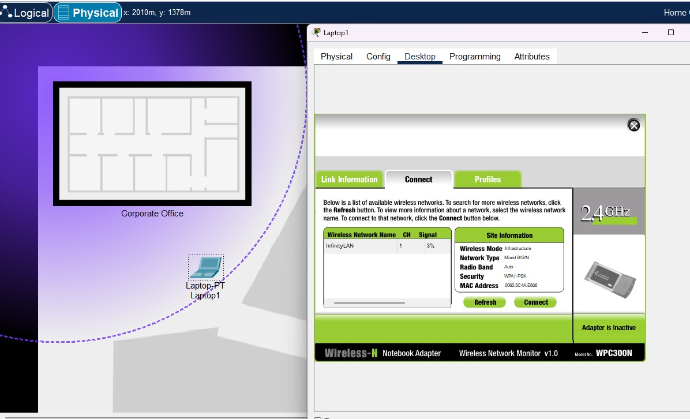
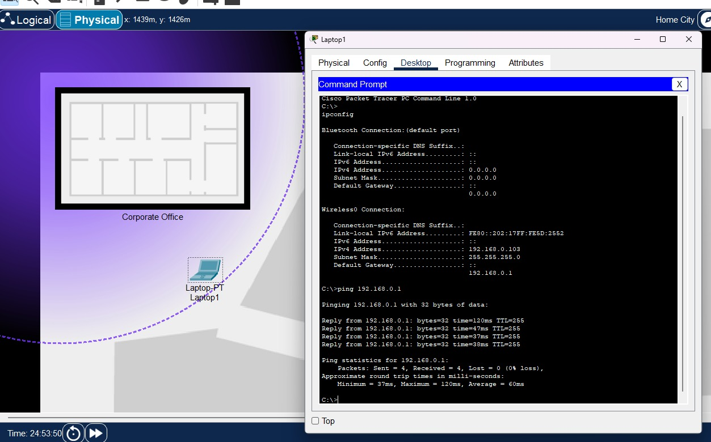

Colocamos la notebook en un sector fuera de la oficina donde la señal es bastante baja, en específico es del 3%. Pero a pesar de esto fue posible conectarse a la red.


Sin embargo cuando la colocamos fuera del rango de la señal Wi-Fi vemos que la señal ni siquiera aparece para seleccionarla para realizar la conexión.

### Conclusión
Al posicionar la notebook en distintas posiciones con respecto a la oficina donde se encuentra el router podemos ver como se produce la pérdida de la señal a medida que nos alejamos de la fuente (router). Esto se debe a la pérdida gradual de la intensidad de la onda electromagnética debido a la absorción y dispersión por el medio en el cual se propaga.
