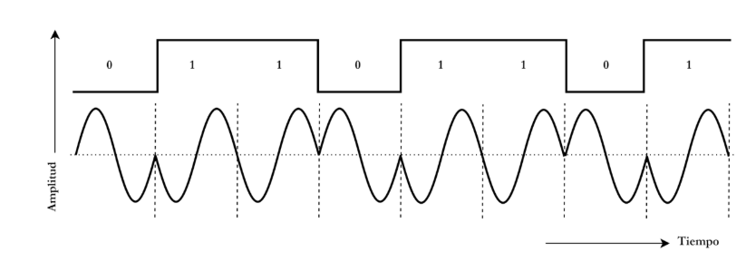
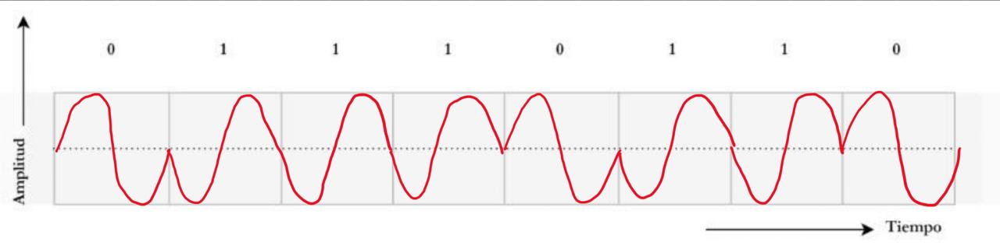

## 3. Transmitir una señal escalonada de forma inalámbrica
Transmitir una señal escalonada de forma inalámbrica puede ser muy problemático, ya que esta cambia bruscamente 
de un valor a otro, lo cual representa un salto instantáneo en el dominio del tiempo y esto implica que en 
dominio de la frecuencia tiene infinitos armónicos, es decir, muchas frecuencias muy altas. De lo estudiado en
la teoría de la Transformada de Fourier sabemos que **cuanto más abrupta es la transición en el tiempo, más ancho
es su espectro en frecuencia**.
Por lo tanto, para reproducir una transición instantánea se necesita transmitir a frecuencias muy altas, y en 
la práctica los sistemas inalámbricos tienen un ancho de banda limitado lo que hace que la señal se suavice y deje
de ser un escalón perfecto (se redondean sus bordes), además en los canales inalámbricos las frecuencias altas se atenúan más que la bajas, esto significa que las transiciones rápidas se pierden o se retrasan, deformando la señal.
Otra cuestión a tener en cuenta considerando que el espectro en frecuencia ocupa mucho más espacio es que es 
más propensa a interferir con otros canales. Y como su energía se reparte en muchas frecuencias, cada parte se ve más afectada por el ruido.

**a)** 

La modulación observada en la imagen es Phase Shift Keying. Esta es una técnica donde la fase de una portadora
sinusoidal cambia para representar datos digitales (bits).

**b)**
Señal digital modulada:

**c)**
Las principales técnica de modulación para datos digitales son:
- Modulación por Desplazamiento de Amplitud (_ASK_)
- Modulación por Desplazamiento de Frecuencia (_FSK_)
- Modulación por Desplazamiento de Fase (_PSK_)
También existen técnicas más avanzadas como:
- Quadrature Amplitud Modulation (_QAM_)
- Quadrature Phase Shift Keying (_QPSK_)
- M-ary PSK

**d)**
El **BER** (Bit Error Rate o Tasa de Error de bit) es la fracción de bits transmitidos que llegan con error
respecto al total enviado.
Se calcula de la siguiente manera:
$$ BER = \frac{Número de bits erroneos}{Número de bits transmitidos} $$
Entre las técnicas de modulación mencionadas, la que mejor resultados tiene es la PSK.

