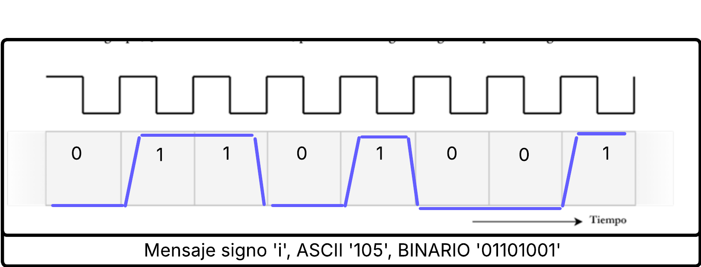

# 2)
## a) 
   Se representa un ***trasmision serie sincrona***. por una sola linea se transmite datos en una sola direccion.
Es sincrono porque la comunicacion depende del pulso de relog compartido entre el receptor y transmisor.

Al ser una sola linea de datos se denomina transmision half duplex
Como no sabemos si la lectura es por flanco de subida o flanco de bajada deducimos que si es de bajada son cmunicaicones ***I2C*** en ambas direcciones , si es ***usart*** es una comunicacion asincrona.
Ninguna correspnde con nuestra grafica.
Por lo cual la comunicacion es ***SPI*** porque hay una linea de clock separada y se lee por flanco de subida.

Viendo la imagen podemos ver que el mensaje es el binario 
```plaintext
1 0 0 1 1 1 1 0 
```
de acuerdo a la imagen :

> 

> **Figura 1:** transmision sincrona.
## b) 
la ventaja de esta transmision es que el mensaje esta sincronizado y el receptor sabe ***cuando leer cada bits***.

Pero ***no seria el mejor paradigma*** ya que la transmision  y recepcion estan compartidas por la misma linea. deberia tener una linea extra para la recepcion. 

## c)
El grafico correcponde a una comunicacion UART, donde el reloj del transmisor no depende del reloj del receptor. 

Estas transmisiones se cominican de acuerdo a un bit de star '1' logico que indica el comienzo de la transmision, luego de 8 ciclos de reloj(de acuerdo al mensaje si es de 1 byte) y un bit de parada '1' logico que determina el fin del mensaje. 

En la omagen podemos ver el mensaje '0 0 1 0 0 0 1 1', omite los bits de inicio y parada. Ese mensjae es el 35 en ascii que corresponde al signo numeral '#'
cada bits es interpretado de acuerdo al valor central del ciclo de reloj del clock del transmisor con el valor que tiene el mensaje en ese momento.

Para transmitir la letra 'i' que es la 4ta letra de nuestro nombre, debemos buscar la tabla ascii de dicha letra.


para pasar el 105 a binario:
```plaintext
    i = ascii = 105 
```
 
Para pasar el 105 a binario:

>   
> **Figura 2:** Conversión paso a paso de ASCII 105 a binario para la letra `'i'`.
por lo tanto el mensaje seria : 
```plaintext
' 0 1 1 0 1 0 0 1'
```
la señal se veria asi:


>   
> **Figura 3:** transmision letra `'i'`.
## d)
Se miden en la mitad del ciclo del reloj.

No se debe medir en los flancos ya que la señal esta cambiando de un estado a otro.