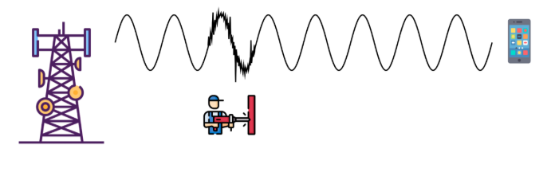
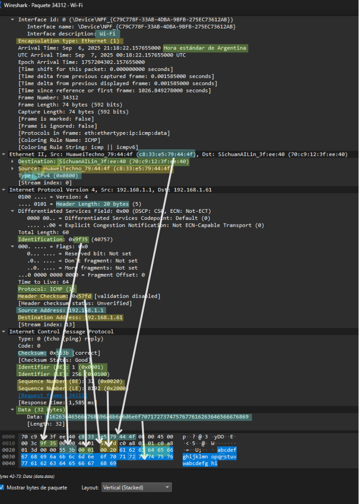

# INFORME TP1 - GRUPO InfinityLAN

### INTEGRANTES:

* Reyeros, Marcos Agustín
* Brezzo, Benjamin
* Castillo, Dario
---
## Consigna 1

---

---

### a) ¿Qué fenómeno físico se representa en la figura?

Se representa la **propagación de ondas electromagnéticas** desde un satélite hacia una embarcación en el océano. Lo que ocurre es que al comunicarse estos 2 medios a ciertas distancia y en movimiento produce lo que causa el llamado "Efecto dopler" cuando el satelita o barco se acercan en movimiento la frecuencia recibida se incrementa como se ve en la imagen y si se alejan la frecuencia disminuye. Esto afecta las comunicaciones satelitales donde el desplazamiento puede ser de algunos khz. Debido a esto los receptores deben ser capaz de poder ajustar dinamicamente la freciencia para mantener la misma señal

**Características principales de propagacion**

- No requiere medio físico, puede propagarse en el vacío.
- frecuencia y longitud de onda como parametros a analizar.
- Atenuación y dispersión. La señal puede debilitarse por distancia, clima o interferencias.

---

### b) ¿Qué tipos de transmisión afecta más este fenómeno? ¿Cuáles son más sensibles?

las transmisiones afectadas pueden ser:

- **Satelital :** Con nivel de sensibilidad alto al efecto dopler, el satelite se mueve rapido respecto al receptor, generando desvios de frecuencia significativos
- **Aeronautica, ADS-B y Radares:** con sensibilidad alta. Las velocidades involucradas son grandes, y el efecto dopler se para estimar la posicion y velocidad del avion.
- **Movil o terrestre 4G/5G:** con sensibilidad media al efecto, el usuario del dispositivo en movimiento genera variaciones de frecuencia que deben compensarse.
- **WI-FI y Bluetooth :**  con sensibilidad baja al efecto en distancias coras y velocidades bajas, el efecto es menor pero puede influir en entornos moviles
- **Cableada, fibraoptica o ethernet :** sensibilidad nula. No tiene propagacon por aire ni movimiento relativo.
---

###  c) ¿Por qué no se debe encender el celular en un avión? ¿Tiene relación con lo anterior?

El poner "modo avion" en los celulares es obligatorio en despegues y aterrizajes por razones tecnicas.

Ocurre lo que es la interferencia electromagnetica, debido a que los celulares transmiten señales en bandas similares a las usadas por los aviones VHF, radar, ILS. Como son muchos pasajeros activos pueden generar ruido o falsas alertas.

Los sistemas criticos durante despegue o aterrizaje, los pilotos dependen de la presicion de sus instrumentos, Una interderencia puede provocar errores en lectura de altitud, presion o aproximacion son visibilidad por clima. 

Por lo que los dispositivos moviles en movimiento cuado el celular intenta conectarse a torres terrestres a gran velocidad y altitud, se generan multiples intentos de conexion que satura las redes del avion, 

---

## Consigna 2

### a) ¿Qué fenómeno físico se está representando en la Figura? ¿Cuáles son las características principales del mismo?

En la figura podemos ver el fenómeno de la interferencia electromagnética (también conocido como _ruido_). La interferencia es una señal eléctrica no deseada que se suma a la señal principal, y la podemos ver representada en la figura como una alteración en la propagación de la onda entre la torre y el smartphone. Los orígenes de las interferencias pueden ser internos (producidos por el propio sistema) o externas (provenientes de dispositivos ajenos) que es el caso de la figura, en ella podemos ver que un taladro mecánico produce la interferencia. 
Las principales características de la interferencia son:
- Superposición de ondas: La base de la interferencia es el principio de superposición, cuando dos o más ondas electromagnéticas coinciden en el espacio y tiempo, sus campos eléctricos y magnéticos se suman. Esto puede producir zonas de refuerzo (constructiva) o de cancelación (destructiva). En la práctica suele haber una combinación de ambas.
- La interferencia depende de la frecuencia de onda.
- Ondas con la misma frecuencia pueden interferir más fácilmente, por ejemplo dos routers en el mismo canal de 2.4 GHz.
- Puede ser constante en el tiempo si las fuentes son coherentes, como dos láseres con la misma frecuencia estable.
- O variable/aleatoria si las fuentes son incoherentes, como ruidos eléctricos.

### b) Recordando las bandas de transmisión vistas en el TP01, investigar: ¿A qué tipos de transmisión afecta este fenómeno? ¿Cuáles son más resilientes al mismo?

Las transmisiones que operan en bandas de alta frecuencia son las más vulnerables al ruido, ya que presentan una mayor sensibilidad frente a obstáculos físicos y condiciones atmosféricas. Por ejemplo, hoy en día es normal que los ISP ofrezcan routers con dos bandas de frecuencias Wi-Fi, una de 5 GHz la cuál tiene la ventaja de ser más rápida pero es muy susceptible a las interferencias y obstáculos físicos. Y la otra señal que ofrece está en una banda de frecuencia más baja (2.4 GHz) pero es más resistente a las interferencias. 

### c) ¿Qué es la SNR? ¿Tiene algo que ver con el concepto de BER que vimos en el TP01?

La SNR (_Signal-to-Noise Ratio_) es una medida que compara la potencia de la señal útil con respecto a la potencia del ruido presente en el mismo canal o medio de transmisión.
- Un mayor SNR significa una señal más fuerte en relación al ruido, lo que implica una mejor calidad en la transmición de la señal.
El BER (Bit-Error-Rate) es la tasa de error de bits, es decir, la proporción de bits transmitidos que se reciben de forma incorrecta debido a interferencias.
- A medida que disminuye el SNR el BER aumenta lo que significa que más bits se reciben de manera errónea.

---

## Consigna 3
### a) ¿Qué es el Ethernet? ¿Cuáles son sus características principales? ¿Cómo se conforma una trama de datos de Ethernet? ¿Qué diferencias hay entre Ethernet, Fast Ethernet y Gigabit Ethernet?
Ethernet es una tecnología de red de área local (LAN) que define como se transmiten los datos entre dispositivos dentro de una misma red cableada. 
**Características principales de Ethernet**
- Topología: Originalmente en bus, pero actualmente se usa en estrella (_switches_).
- Medio físico: Cables de par trenzado (UTP, STP), fibra óptica o coaxial.
- Método de acceso: Usa el protocolo CSMA/CD (_Carrier Sense Multiple Access with Collision Detection_) en redes half-duplex.
- Velocidades: Comenzó con 10Mbps, pero evolucionó a 100M bps (Fast Ethernet), 1 Gbps (Gigabit Ethernet), 10 Gbps e incluso más.
- Direcciones física: Cada dispositivo tiene una dirección MAC única (48 bits).

Una trama Ethernet es la unidad de transmisión. Sus campos principales son:

- Preamble (7 bytes) + Start Frame Delimiter (1 byte). Sincronización.
- Dirección MAC de destino (6 bytes). A quién va dirigido.
- Dirección MAC de origen (6 bytes). Quién envía.
- Tipo / Longitud (2 bytes), indica si es un tipo de protocolo (ej: IPv4, IPv6, ARP) o la longitud de datos.
- Datos (46 a 1500 bytes), carga útil (payload), lo que realmente se quiere transmitir.
- CRC / FCS (4 bytes): código de verificación para detectar errores.

### b) ¿Qué es un cable UTP? ¿Qué relación tiene la construcción de este cable con los conceptos vistos en el ítem 2) de este trabajo? ¿Qué diferencias hay entre un cable UTP "derecho" y uno "cruzado"?
UTP significa Unshielded Twisted Pair. Es el tipo de cable más usado en redes Ethernet. Está compuesto por 4 pares de hilos de cobre trenzados entre sí, sin recubrimiento metálico extra (de este viene el _unshielded_).
**Relación entre la construcción UTP y la interferencia**:
- Cada par transmite señales diferenciales (la señal va por un hilo y la inversa por el otro).
- Al trenzarlos, las interferencias externas afectan de manera similar a ambos hilos, y el receptos puede resetearlas. Esto se conoce como cancelación de ruido común o CMRR.
- Cada par tiene un número de giros diferentes por metro, para que no se acople demasiado la interferencia entre pares (crosstalk).
Por eso es que aunque no tengan blindaje metálico, los UTP pueden funcionar muy bien hasta altas frecuencias.
**Diferencias enrte cable UTP "derecho" y "cruzado"**
- Cable derecho:
  - Los pines de ambos extremos siguen el mismo orden de colores (por ejemplo T568B en ambos lados).
  - Se utiliza para conectar dispositivos diferentes: PC con switch, PC con router, switch con router.
- Cable cruzado:
  - Los pares de transmisión y recepción se invierten en un extremo.
  - Se usa para conectar dos dispositivos iguales entre sí, como dos switches por ejemplo.

### c)
inicializar wireshark en la interfaz activa WI-FI

# comando cmd : ipconfig

# copiar la direccion ip
---

# filtrado por la direccion ip:

ip.addr == 192.168.1.61

# haciendo ping hacia una red externa para ver trafico a google

# ping localmente 

# filtrado para ver ping al router local mediante comando icmp

# visualizacion de un paquete 

## hexa:

# datos del paquete:

# analisis de datos paquete :

**Ethernet II**  
Es la capa de enlace. Muestra las direcciones MAC de origen y destino. En este caso,(`Tp-LinkT_7d:44:6f`) está enviando datos al router (`SichuanUnifi_f1:3e:40`).

**IPv4**  
Es la capa de red. Indica que el paquete va desde la IP local `192.168.0.103` hacia el gateway `192.168.0.1`. Usa el protocolo TCP.

**TCP (Transmission Control Protocol)**  
Es la capa de transporte. Este paquete tiene el flag **SYN**, lo que significa que está iniciando una conexión TCP. Es el primer paso del "handshake" que se usa para establecer comunicación confiable entre dos dispositivos.

**Puerto origen: 49270**  
Es un puerto dinámico asignado por tu sistema.

**Puerto destino: 80**  
Indica que el paquete va hacia un servidor web (HTTP).

**Número de secuencia: 0**  
Como es el primer paquete, comienza en cero.

**Tamaño de ventana: 64240**  
Define cuántos bytes puede recibir el dispositivo antes de enviar una confirmación.

**Opciones TCP**  
Incluye parámetros como MSS (tamaño máximo de segmento), SACK (reconocimiento selectivo), escalado de ventana y timestamps. Sirven para optimizar la conexión.

## d) Extraer de la información del punto anterior la dirección MAC del dispositivo. Documentar la misma e investigar datos del fabricante en internet. Documentar el nombre y dirección de la empresa.
El encabezado que se muestra es `70 c9 12 3f ee 40 c8 33 e5 79 44 4f 08 00`, donde se identifican los siguientes componentes:
- Dirección MAC de destino: `70 c9 12 3f ee 40`
- Dirección MAC de origen: `c8 33 e5 79 44 4f`
- Luego de esto arranca el paquete IPv4 (`08 00`)

Ingresando la dirección MAC de destino en la página [macaddress.io](https://macaddress.io/) encontramos la siguiente información:
- OUI (Organizationally Unique Identifier): C8:33:E5
- Company name: Huawei Tech Co, Ltd
- Company address: No.2 Xin Cheng Road, Room R6,Songshan Lake Technology Park Dongguan 523808 CN

## e) Repetir los ejercicios c) y d), pero comunicándote con la computadora de un campañeto/a.
Para realizar este inciso utilizaremos dos computadoras en la misma red.

**PC principal**:

- Dirección IPv4: 192.168.0.255
- Máscara de subred: 255.255.255.0
- La *puerta de enlace predeterminada es*: `192.168.0.1`

**PC secundara**:

- Interfaz activa: wlp0s20f3 (Wi-Fi)
- Dirección IPv4: 192.168.0.169
- Máscara (por el /24): 255.255.255.0
- Dirección de broadcast: 192.168.0.255

Desde la PC principal hacemos ping 192.168.0.169 (la IP de la PC secundaria).
Desde la PC secundaria hacemos ping 192.168.0.225 (la IP de la PC principal).
Y en Wireshark vemos:

- Source: `66:7a:72:21:a9:89` → MAC de la máquina que envía el paquete.
- Destination: `2c:f0:5d:8a:fc:1a` → MAC de la máquina que recibe el paquete.

**Identificación de los fabricantes**
Utilizando otra vez la página [macaddress.io](https://macaddress.io/) para la dirección de destino:
- OUI (Organizationally Unique Identifier): 2C:F0:5D
- Company name: Micro-Star Int'L Co, Ltd
- Company address: No.69, Lide St., New Taipei City Taiwan 235 TW

## Consigna 4 – Reflexiones finales y conclusiones

**Privacidad y trazabilidad en la red**  
Cada dispositivo conectado a una red queda identificado por su **dirección MAC**. Esta dirección, única para cada tarjeta de red, permite a los administradores rastrear la actividad de un dispositivo dentro de la red local. Si bien es útil para control y seguridad, también plantea riesgos de privacidad porque deja un rastro permanente de cada conexión.

**IMEI y su relación con la MAC**  
El **IMEI (International Mobile Equipment Identity)** es un número único que identifica a los teléfonos móviles en las redes celulares.  
La similitud con la MAC es que ambos son identificadores únicos de hardware:  
- La **MAC** identifica al dispositivo en una **red local** (Wi-Fi o Ethernet).  
- El **IMEI** identifica al terminal en la **red celular** (2G/3G/4G/5G).  

En ambos casos, estos códigos pueden usarse para bloquear, localizar o rastrear equipos, lo que tiene implicaciones tanto de seguridad como de privacidad.

**VPN y dirección MAC**  
Una **VPN (Virtual Private Network)** enmascara la **dirección IP pública** y cifra el tráfico, evitando que los sitios web vean la IP real del usuario.  
Sin embargo, **la VPN no oculta la dirección MAC**:  
- La MAC solo se transmite hasta el primer salto (el router o switch local).  
- El ISP o el administrador de la red Wi-Fi pueden verla.  
- Los servidores externos en internet (a los que se accede a través de la VPN) nunca reciben la MAC, por lo tanto, no la conocen.

**Conclusión general**  
El trabajo permitió comprender cómo, incluso en redes aparentemente seguras, los dispositivos dejan identificadores únicos (MAC o IMEI) que hacen posible su trazabilidad. Las herramientas como Wireshark muestran con claridad la exposición de esta información. Aunque las VPN protegen la IP y el contenido de la comunicación, no eliminan totalmente las huellas locales como la dirección MAC.