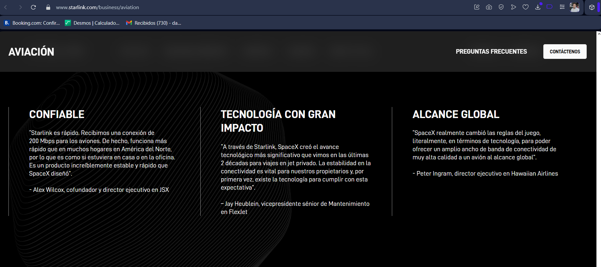

# 2

## a) Tipos de transmisión, diferencias y costo (según figura)
La imagen muestra (izq) fibra monomodo y (der) fibra multimodo.

Monomodo: núcleo muy pequeño (~9 µm), solo un modo de luz (camino recto). Casi no hay dispersión modal, sirve para altas velocidades y largas distancias (troncales, DWDM). Usa láseres más precisos: transceptores más caros.

Multimodo: núcleo mayor (50/62.5 µm), muchos rayos rebotando. Hay dispersión modal: limita distancia y tasa (uso típico: interior de edificio / datacenter). Módulos ópticos más baratos (LED o VCSEL) pero menos alcance.

En resumen: monomodo = más alcance / ancho de banda; multimodo = menor costo inicial en enlaces cortos. La más costosa de implementar (sobre todo en óptica activa) es monomodo. 

## b) Ley de Snell y modos en la fibra
Ley de Snell (forma básica):
```
n1 · sen(θ1) = n2 · sen(θ2)
```
Dice que al pasar de un medio a otro (con distintos índices de refracción) el rayo cambia su dirección.

Aplicado a la fibra: el núcleo tiene un índice un poco mayor que el revestimiento. Eso hace que, para ciertos ángulos, la luz no “escape” sino que rebote dentro (reflexión interna total). Así la señal viaja guiada a lo largo del cable.

Relación con los modos: en una fibra multimodo entran muchos ángulos diferentes que cumplen esa condición de varios caminos (modos) y más dispersión. 

En una fibra monomodo el núcleo es más pequeño y solo se permite esencialmente un camino recto de un solo modo, menos dispersión y más distancia. Todo parte del mismo principio de Snell y la diferencia de índices. 

## c) Relación con conexiones inalámbricas
Similitudes: ambas usan ondas electromagnéticas, requieren modulación y multiplexación, se calcula un presupuesto de enlace y hay atenuación/ruido.

Diferencias clave: fibra es guiada (poca interferencia y más seguridad); inalámbrico es no guiado (interferencia, propagación multipath). Fibra ofrece enorme ancho de banda y larga distancia; inalámbrico aporta movilidad y facilidad de despliegue. 

El número de modos (definido por las condiciones de Snell y el diseño físico) impacta en alcance y costo. Monomodo para distancias y capacidades altas; multimodo para tramos cortos económicos; inalámbrico complementa con flexibilidad.

---

# 4) Conectividad a Internet en un Avión (estado del arte)

## 4.a Tecnologías usadas y características
Principales enfoques que permiten que un pasajero tenga Internet mientras vuela:

1. Aire‑Tierra (ATG):
	- El avión se conecta con antenas terrestres hacia abajo (similar a una celda móvil). 
	- Ventajas: menor latencia (~50–80 ms). 
	- Limitaciones: depende de cobertura sobre tierra; sobre océanos/no hay antenas.

2. Satelital:
	- Antena apunta a satélite. 
	- Cobertura global (salvo latitudes extremas). 
	- Latencia alta. 

3. Modelos híbridos: 
	- El proveedor usa satélite sobre océano y ATG sobre tierra; el sistema conmuta según disponibilidad para optimizar latencia y costo.

Elementos a bordo:
 - Antena + modem satelital/ATG.
 - Router/captivo Wi‑Fi dentro de la cabina. 

Limitaciones generales: costo por MB alto, espacio/peso, consumo eléctrico, certificaciones aeronáuticas y necesidad de “beam handover” (cambio de haz) sin cortar sesiones.

## 4.b Publicación científica/tecnológica

www.starlink.com/aviation

## 4.c División del tráfico
La idea es simple: dentro del avión conviven dos cosas:
1. Contenido local (películas, series, mapa del vuelo, juegos). Está guardado en un servidor dentro del avión. Cuando lo mirás, no “sale” nada al enlace caro.
2. Internet real (correo, redes, streaming externo). Eso sí viaja por el enlace satélite o aire‑tierra y es lo que cuesta y tiene más demora.

Conexion:

Cuando una persona se conecta entra a un portal (aceptar condiciones / pagar si corresponde).

Evitar saturacion:
- Guardan (cachean) el contenido popular localmente.
- Ponen límites a descargas pesadas y priorizan cosas livianas (correo, mensajería).
- Bloquean usos que solo consumen ancho de banda (descargas grandes, p2p).

Ventajas de la division:
- El entretenimiento va fluido y no depende del satélite.
- Se reduce el uso (y costo) del enlace externo.
- La experiencia parece “más rápida” aunque el satélite tenga más latencia.

De esta forma se ahorra ancho de banda caro sirviendo local lo que todos miran y solo se manda afuera lo que realmente es Internet.
