# 1. Alcance de Redes y Virtualización
## a) Clasificación y características de las redes según su alcance
1. **PAN (Personal Area Network) - Red de Área Personal**
   Tiene un alcance de unos pocos metros, aproximadamente de 1 a 10m.
    
    Ejemplos:
   - Conexión Blutooth entre el celular y los auriculares.
   - Comunicación entre smartwatch y celular.
   - Conexiones USB o infrarrojas.
    
    Características:
   - Están diseñadas para uso personal.
   - Son de baja potencia y corto alcance.
   - No requieren de infraestructura compleja.
2. **LAN (Local Area Network) — Red de Área Local**
    Tiene un alcance de unos cientos de metros o algunos kilómetros (por ejemplo, dentro de un edificio o campus).

    Ejemplos:
    - La red de computadores de una universidad o empresa.
    - Las red de una casa particular con su router Wi-Fi.

    Características:
    - Alta velocidad (100 Mbps - varios Gbps).
    - Administración local.
    - Puede ser cableada (Etherner) o inalámbrica (Wi-Fi).
3. **MAN (Metropolitan Area Network) - Red de Área Metropolitana**
    Tiene un alcance más amplio que una LAN, generalmente abarcando toda una ciudad.

    Ejemplos:
    - Red de proveedores de internet urbanos.
    - Las redes de televisión por cable disponibles en muchas ciudades.
    
    Características:
    - Conecta múltiples LAN dentro de una ciudad.
    - Usa fibra óptica, microondas o enlaces inalámbricos urbanos.
4. **WAN (Wide Area Network) - Red de Área Extensa**
    Son aquellas que abarcan una extensa área geográfica, como un país o continente.

    Ejemplos:
    - Internet.
    - La red privada de una empresa multinacional.
  
    Características:
    - Conecta muchas LAN, MAN, etc.
    - Usa infraestructuras públicas (telecomunicaciones, satélites, cables submarinos).
    - Latencia más alta y velocidades variables.
5. **GAN (Global Area Network) - Red de Alcance Global**
    Tienen un alcance global.

    Ejemplos:
    - Internet de redes corporativas interconectadas a nivel mundial.
    - Red global de satélites que da cobertura planetaria.
    
    Características:
    - Interconecta varias WAN.
    - Soporta comunicación global (incluso con movilidad internacional).
6. **VLAN (Virtual Local Area Networks)**

## b) Redes VLAN
Las redes VLAN son redes lógicas que dividen una LAN física en múltiples LAN lógicas independientes. Estas redes permiten 
segmentar y administrar grupos de dispositivos según criterios lógicos en lugar de criterios físicos. Las redes VLAN son 
esenciales para la segmentación y administración de dispositivos en una red, brindando flexibilidad y seguridad en la gestión de 
redes. Se basan en switches especialmente diseñados para este propósito y se identifican con colores o etiquetas.

Beneficios de las redes VLAN:
- Ofrecen flexibilidad en la configuración de la red.
- Permiten que la distribución del equipo de red no tenga que coincidir con la estructura física de la organización.

Ejemplo: En una empresa hay tres sectores
- Administración
- Recursos humanos
- Laboratorio

Todos están conectados al mismo switch físico, pero no se quiere que se puedan ver el tráfico entre sí (por seguridad y organización).

Entonces se crea:
- VLAN 10 para la administración
- VLAN 20 para recursos humanos
- VALN 30 para el laboraotorio
De esa forma, aunque físicamente estén conectados al mismo switch, lógicamente están aislados como si fueran redes separadas.
   
Clasificación:

1. Según la asignación (forma de identificar la VLAN)

|     Tipo de VLAN     | Descripción    |
|----------------------|-----------------|
| VLAN por puerto (Port-based VLAN) | Cada puerto del switch pertenece a una VLAN específica. Es la forma más común y fácil de configurar. |
| VLAN por dirección MAC | El switch asigna la VLAN según la dirección MAC del dispositivo. Si el dispositivo se mueve a otro puerto, sigue en su misma VLAN. |
| VLAN por protocolo | Se agrupan según el protocolo de capa 3 (por ejemplo, IPv4, IPv6, IPX, etc.). |
| VLAN por subred IP | Los dispositivos con direcciones IP dentro de una misma subred se asignan automáticamente a la misma VLAN. |
|VLAN dinámica (mediante VMPS o 802.1X)| La asignación se hace automáticamente mediante un servidor que reconoce al usuario o al dispositivo y lo asigna a su VLAN correspondiente.|

2. Según la función o tipo de tráfico

|     Tipo de VLAN     | Uso principal   |
|----------------------|-----------------|
| VLAN de datos (Data VLAN) | Transporta tráfico de usuarios normales (PCs, impresoras, etc.). |
| VLAN de voz (Voice VLAN) | Separada especialmente para tráfico de VoIP. Garantiza calidad de servicio (QoS). |
| VLAN nativa (Native VLAN) | Se usa para tráfico no etiquetado en enlaces troncales (por defecto suele ser la VLAN 1). |
| VLAN de administración (Management VLAN) | Dedicada al acceso de gestión del switch, routers, etc. |
| VLAN predeterminada (Default VLAN) | VLAN inicial del switch (también suele ser la VLAN 1). Todos los puertos pertenecen a ella hasta que se configuren manualmente. |

## c) Protocolo IEEE 802.1Q
El protocolo IEEE 802.1Q es el estándar que define cómo se implementan las VLANs en redes Ethernet. En otra palabras, es el 
protocolo que permite que varias VLAN viajen por el mismo enlace físico (como un cable entre dos switches, o entre un switch y un router) sin mezclarse.

## d) Tagging
El 802.1Q agrega una etiqueta (tag) dentro del encabezado Ethernet para indicar a qué VLAN pertenece cada trama.

Sin VLAN (Ethernet estándar):

```
[Dest MAC] [Src MAC] [Tipo/Longitud] [Datos] [FCS]
```
Con VLAN:

```
[Dest MAC] [Src MAC] [Tag 802.1Q] [Tipo/Longitud] [Datos] [FCS]
```

La etiqueta 802.1Q Tag ocupa 4 bytes adicionales insertados justo después de las direcciones MAC.

**Estructura del tag 802.1Q**

|     Campo     | Tamaño   | Descripción | 
|----------------------|-----------------| -----------------|
|     TPID (Tag Protocol Identifier)    | 16 bits   | Valor fijo 0x8100 que indica que el frame está etiquetado con 802.1Q. | 
|    PCP (Priority Code Point)     | 3 bits   | Prioridad (para QoS, útil por ejemplo en voz). | 
|     DEI (Drop Eligible Indicator)     | 1 bit   | Indica si el frame puede descartarse en congestión. | 
|     VID (VLAN Identifier)     | 12 bits   | Identificador de VLAN (de 1 a 4094). | 

# 2. Implementación de topología en Packet Tracer

En base a la consigna, realizamos la siguiente implementación en Packet Tracer e inicialmente solo configuramos el ruteo
de las PCs en base a la tabla de ruteo provista:

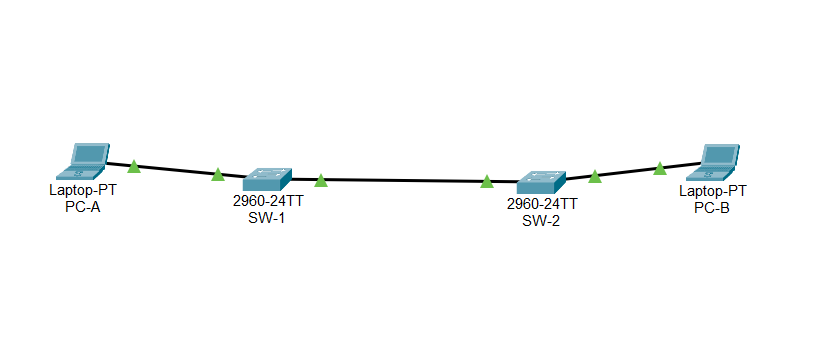

Configuración de PCs:


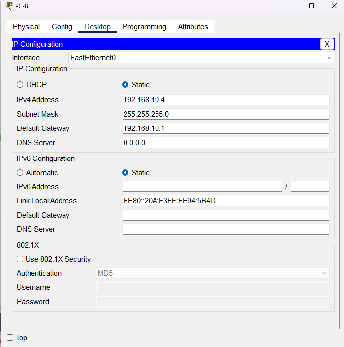

## a) Configuración de los switch (cambiar sus nombres)
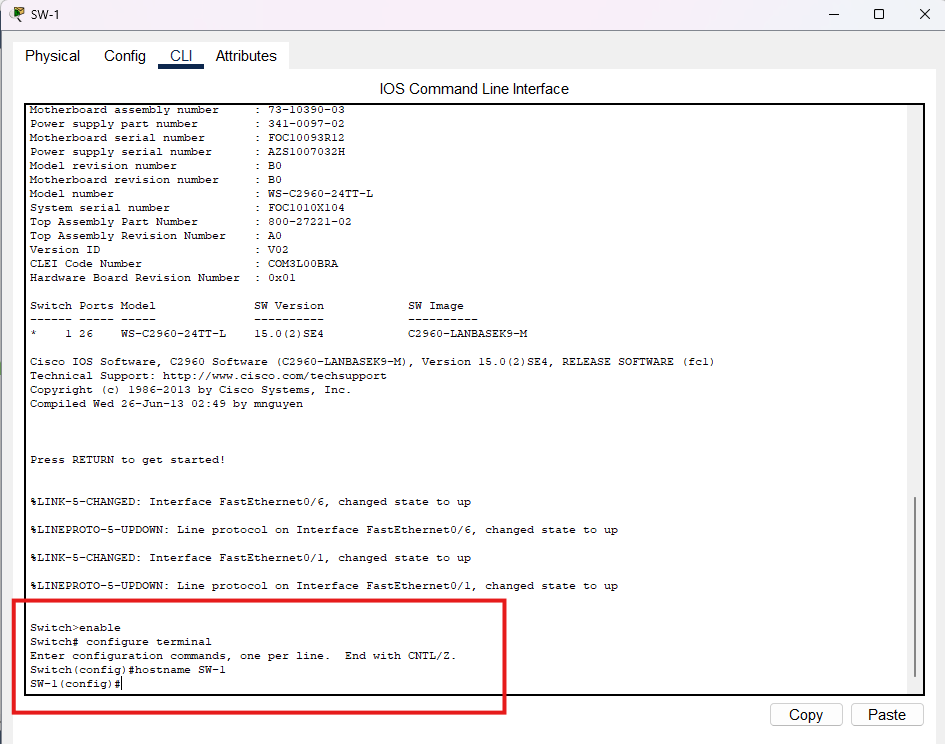
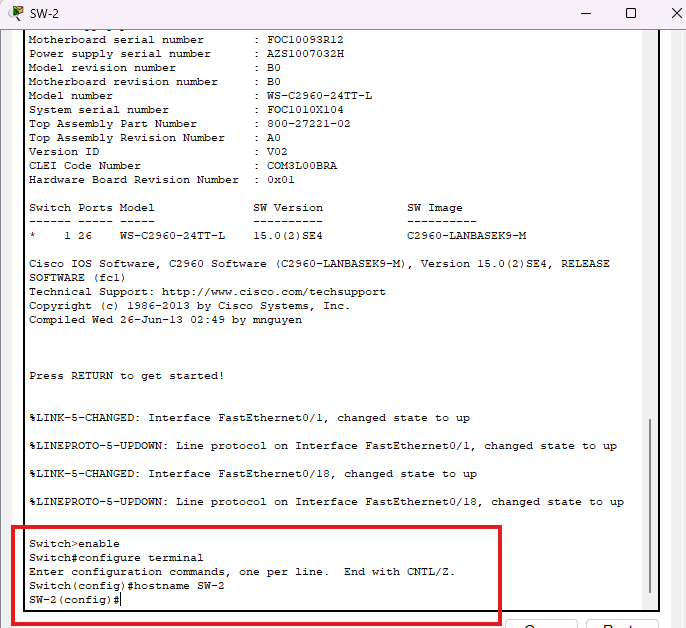

## b) Asignar contraseñas privilegiadas, de consola y vty
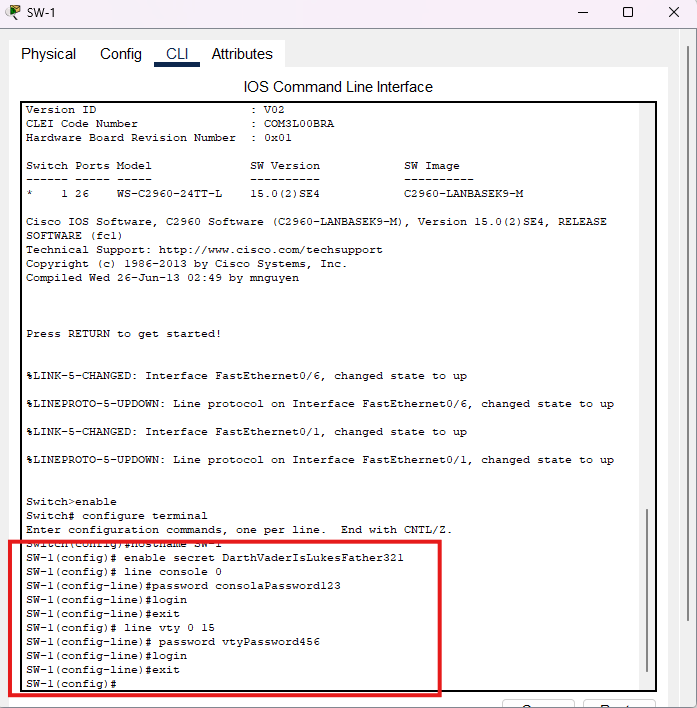
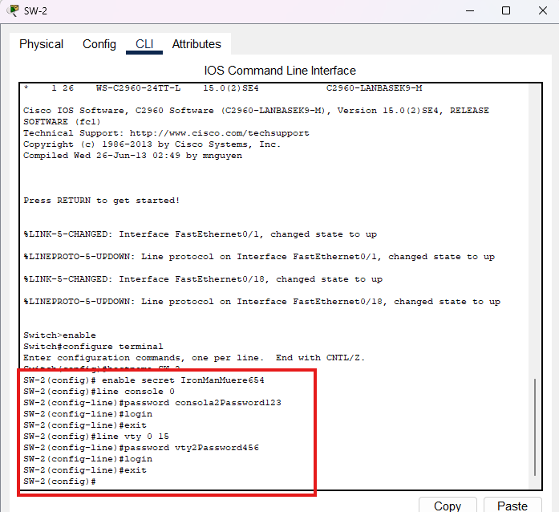

## c) Encriptado de las contraseñas
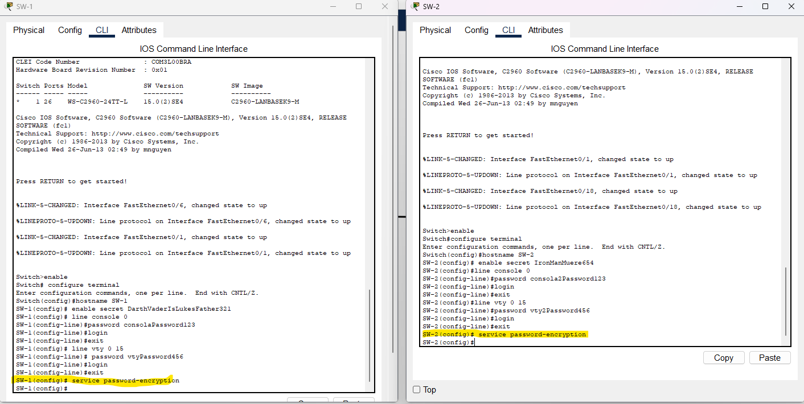

## d) Configuración IP en VLAN 1 según datos de la tabla
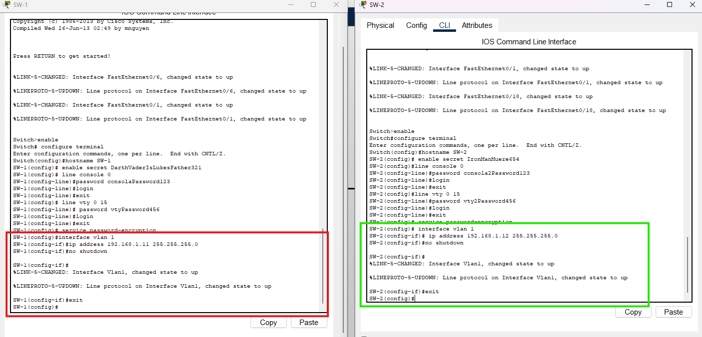

## e) Desconexión de terminales que no se están usando
Para el SW-1 solo Fa0/1 y Fa0/6 están en uso, esto se sabe de antemano por el armado de la topología:
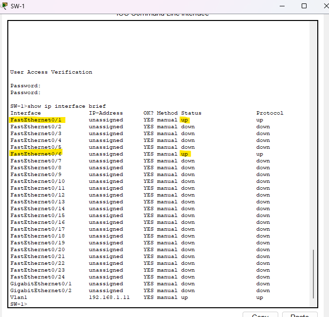

Apagamos las demás interfaces que no se usan. Esta es una buena práctica para evitar conexiones no autorizadas o confusiones:
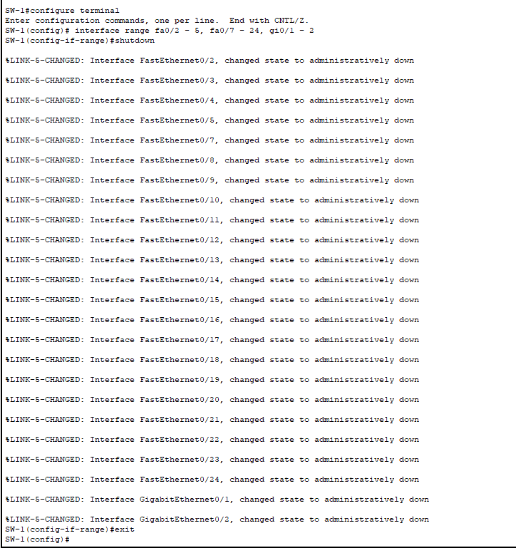

Hacemos lo mismo para el SW-2, pero para este caso las interfaces en uso son Fa0/1 y Fa0/18:

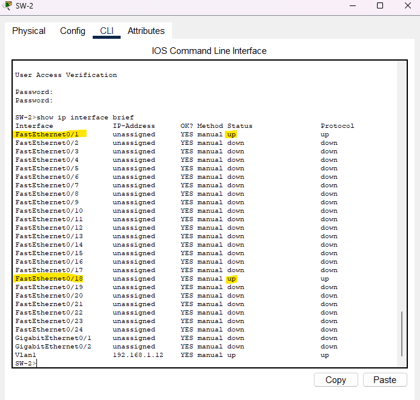

Y apagamos las interfaces que no se usan:
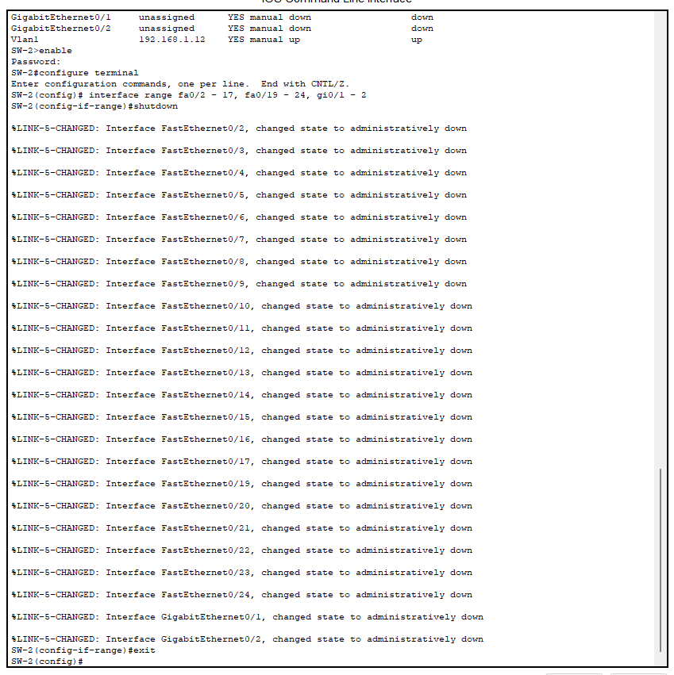

## f) Guardado de la configuración
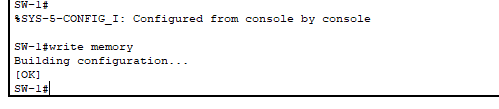


## g) Testeo de comunicación
Verificamos la conexión entre los switeches. Si se recibe una repuesta con `!!!` la conexión entre los switches está funcionando correctamente.

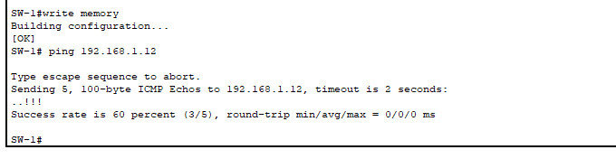

## h) Creación de VLANs en los switches
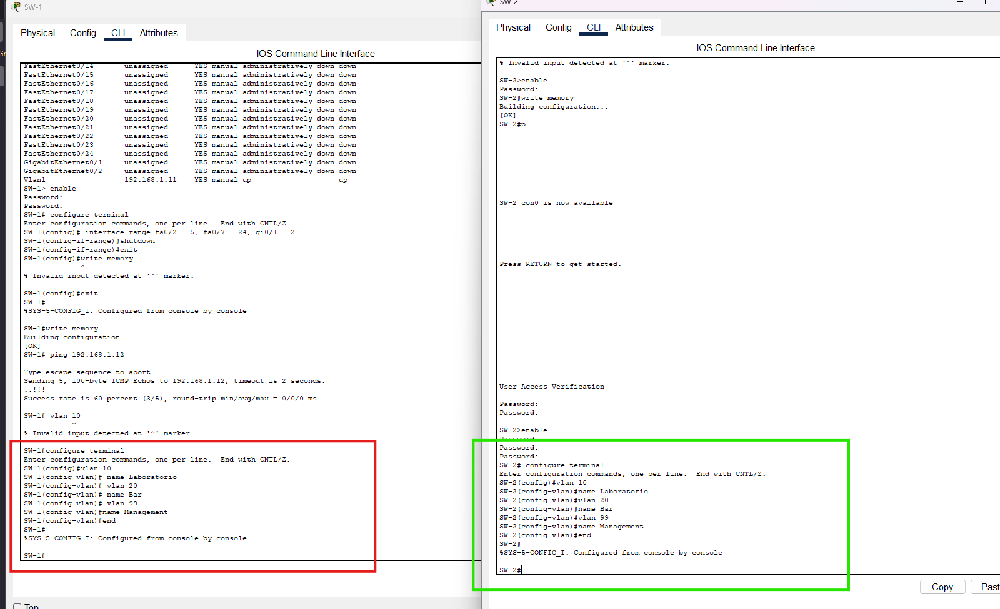

Podemos verificar que se crearon correctamente:
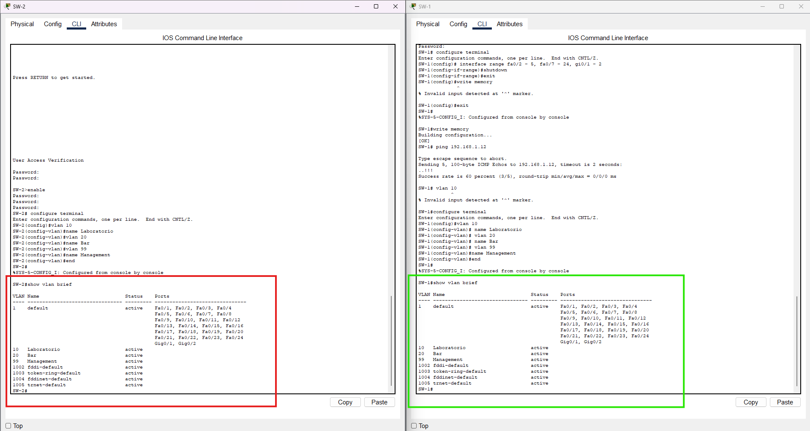

## i) Visualizar lista de VLAN
En la captura del punto anterior donde se verifica que las VLAN se hayan creado correctamente se puede observar la lista de las VLAN utilizadas. **La VLAN por defecto es la 1**.

## j) Asignación de PC-A a VLAN Laboratorio
La PC-A está conectada al puerto Fa0/6 del switch SW-1. Para asignarla a la VLAN de Laboratorio tenemos que seleccionar la VLAN 10:
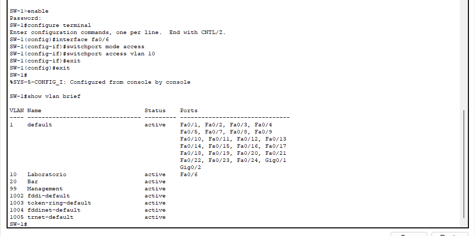

## k) Configuración IP de Management
Se tiene configurado la IP de administración en VLAN 1, pero la VLAN 1 no se debe usar para administración. Vamos a mover
esta IP a la VLAN 99 que se creo con el nombre de Management:

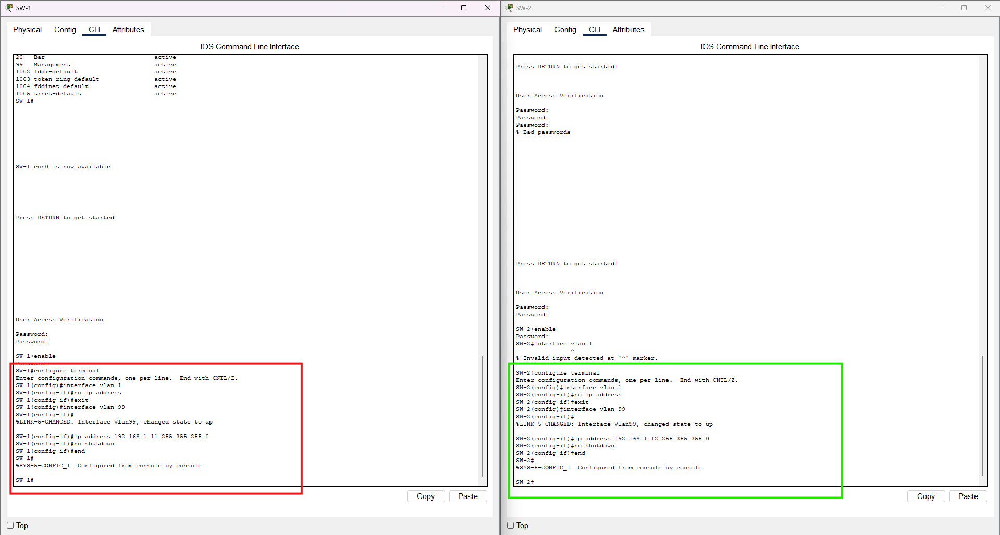

## l) Estado de la VLAN
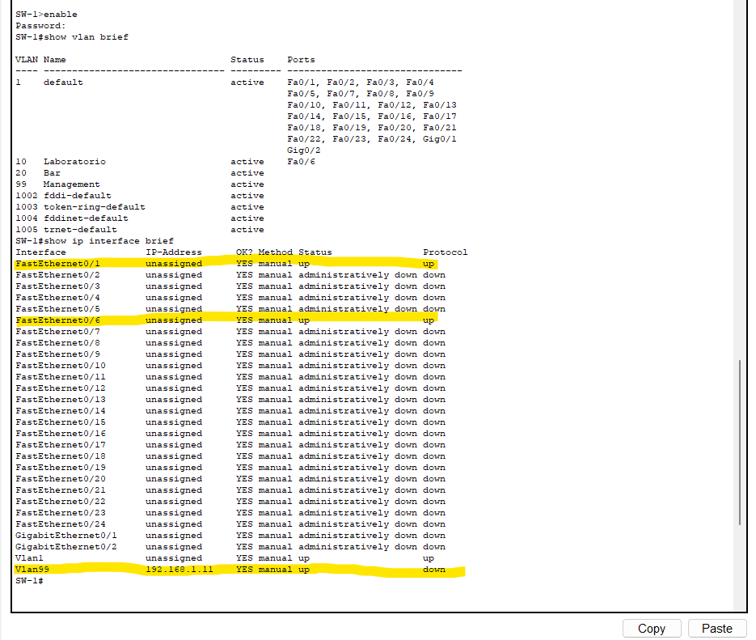

Comando `show vlan brief`:

| VLAN      | Nombre                              | Estado | Puertos asociados                               | Interpretación                                                                                                                                                                                |
| --------- | ----------------------------------- | ------ | ----------------------------------------------- | --------------------------------------------------------------------------------------------------------------------------------------------------------------------------------------------- |
| 1         | default                             | active | Fa0/1, Fa0/2–Fa0/5, Fa0/7–Fa0/24, Gig0/1–Gig0/2 | Esta es la **VLAN por defecto**. Todos los puertos aparecen listados aquí porque, aunque muchos estén administrativamente apagados, por defecto pertenecen a VLAN 1 mientras no se reasignen. |
| 10        | Laboratorio                         | active | Fa0/6                                           | Es la VLAN configurada para el **Laboratorio**, donde se conectó la PC-A. Su puerto asignado (Fa0/6) está **activo y operativo**.                                                             |
| 20        | Bar                                 | active | —                                               | VLAN creada correctamente pero **sin puertos asignados**, por eso no muestra interfaces asociadas.                                                                                            |
| 99        | Management                          | active | —                                               | VLAN de administración creada correctamente. No tiene puertos físicos asociados (sólo la interfaz VLAN99 lógica).                                                                             |

Las VLANs fueron creadas exitosamente (Laboratorio, Bar y Management).
Los puertos se encuentran correctamente asignados según las consignas:

Fa0/6 → VLAN10 (Laboratorio)

Resto → permanecen en VLAN1 (default).

Comando `show vlan brief`:

La mayoría de las interfaces FastEthernet (Fa0/2–Fa0/24) aparecen con el estado
administratively down, lo cual confirma que fueron correctamente deshabilitadas según el punto (e).

Las interfaces Fa0/1 y Fa0/6 están up/up, es decir habilitadas y con enlace físico activo.

- Fa0/1 está conectada al otro switch (SW-2).

- Fa0/6 está conectada a la PC-A.


| Interfaz | Dirección IP | Estado  | Interpretación                                                                                                                                    |
| -------- | ------------ | ------- | ------------------------------------------------------------------------------------------------------------------------------------------------- |
| VLAN1    | unassigned   | up/up   | Interfaz VLAN por defecto sin IP asignada (fue deshabilitada su IP en el punto k).                                                                |
| VLAN99   | 192.168.1.11 | up/down | VLAN de **Management** correctamente configurada con su IP, pero **sin puertos activos asociados a la VLAN99**, por eso el protocolo está “down”. |


## m) Asignación de PC-B a VLAN Laboratorio del SW-2


*En el inciso k) ya se configuró el VLAN Management del SW-2.*

## n) Conectividad entre PC-A y PC-B

Se realizó una prueba de conectividad utilizando el comando `ping` desde la PC-A (192.168.10.3) hacia la PC-B (192.168.10.4) y desde
la PC-B hacia la PC-A. Nos dió como resultado tres respuesta "Request timed out", indicando que no existe comunicación entre
ambas computadoras:

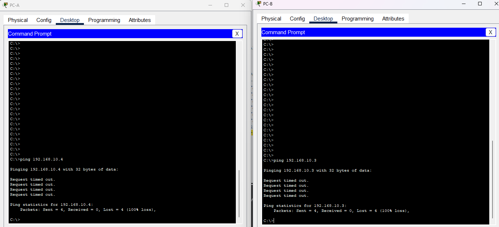

Al verificar la configuración de los switches SW1 y SW2, se observó que las interfaces utilizadas para conectarlos entre si (FasrEthernet 0/1) no estaban configuradas como enlaces trunk. Esto significa que dichos puertos solo estaban permitiendo en tráfico de la VLAN nativa (VLAN 1), y por lo tanto todos los paquetes pertenecientes a la VLAN 10 (Laboratorio), en la cual se encuentran las PC-A y PC-B, no podían ser transmitidos entre los switches.

Para resolver este problema se configuraron los puertos FastEthernet 0/1 de ambos switches como enlaces trunk, mediante los siguientes comandos:

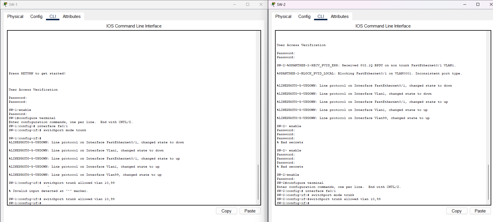

Durante la configuración del enlace trunk, al establecer el modo trunk en SW-1 antes que en SW-2, se generaron mensajes de protocolo Spanning Tree (STP) en SW-2 indicando una inconsistencia de tipo de puerto. Esto ocurre porque el SW-1 comenzó a enviar tramas etiquetadas 802.1Q hacía un puerto del SW-2 que aún estaba en modo access.

Con esta configuración, el enlace entre los switches quedó habilitado para transportar tráfico de las VLAN 10 (Laboratorio) y 99 (Administración).

Se repitió el comando `ping` entre ambas PCs y se obtuvieron respuestas exitosas:

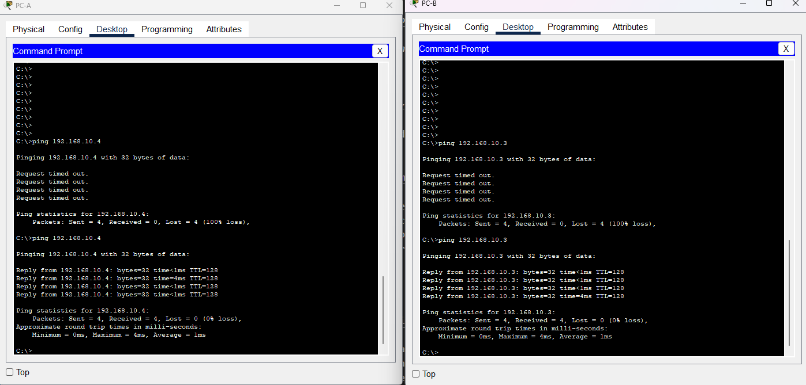

Esto confirma que la comunicación entre las dos computadoras de la VLAN Laboratorio se estableció correctamente y que el enlace trunk está funcionando adecuadamente.


# 3

## ESQUEMA TOPOLOGICO:


## ESQUEMA FISICO:


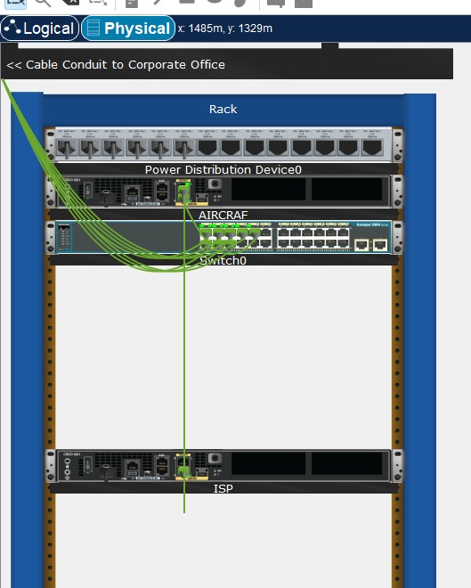


## FONDO :


## CONFIGURACION DE ROUTER AIRCRAF 
 ```
 enable
conf t
! Trunk hacia el switch
interface GigabitEthernet0/0/0
 no shutdown
!
interface GigabitEthernet0/0/0.10
 encapsulation dot1Q 10
 ip address 192.168.10.1 255.255.255.0
 ip nat inside
 ip access-group BLOQ_TURISTA in
!
interface GigabitEthernet0/0/0.20
 encapsulation dot1Q 20
 ip address 192.168.20.1 255.255.255.0
 ip nat inside
!
interface GigabitEthernet0/0/0.30
 encapsulation dot1Q 30
 ip address 192.168.30.1 255.255.255.0
 ip nat inside
!
interface GigabitEthernet0/0/0.40
 encapsulation dot1Q 40
 ip address 192.168.40.1 255.255.255.0
 ip nat inside
!
! Hacia ISP
interface GigabitEthernet0/0/1
 ip address 200.0.0.1 255.255.255.252
 ip nat outside
 no shutdown
!
! NAT PAT
ip access-list standard NAT_INSIDE
 permit 192.168.0.0 0.0.255.255
ip nat inside source list NAT_INSIDE interface GigabitEthernet0/0/1 overload
!
! Ruta por defecto
ip route 0.0.0.0 0.0.0.0 200.0.0.2
!
! DHCP (DNS = servidor 192.168.40.10)
ip dhcp excluded-address 192.168.10.1 192.168.10.20
ip dhcp excluded-address 192.168.20.1 192.168.20.20
ip dhcp excluded-address 192.168.30.1 192.168.30.20
ip dhcp excluded-address 192.168.40.1 192.168.40.20

ip dhcp pool TURISTAS
 network 192.168.10.0 255.255.255.0
 default-router 192.168.10.1
 dns-server 192.168.40.10

ip dhcp pool BUSINESS
 network 192.168.20.0 255.255.255.0
 default-router 192.168.20.1
 dns-server 192.168.40.10

ip dhcp pool ADMIN
 network 192.168.30.0 255.255.255.0
 default-router 192.168.30.1
 dns-server 192.168.40.10

ip dhcp pool SERVIDORES
 network 192.168.40.0 255.255.255.0
 default-router 192.168.40.1
 dns-server 192.168.40.10
!
! ACL: Turista solo servidor local + DHCP/DNS/ICMP
ip access-list extended BLOQ_TURISTA
 10 permit udp 192.168.10.0 0.0.0.255 eq 68 any eq 67
 20 permit udp any eq 67 192.168.10.0 0.0.0.255 eq 68
 30 permit udp 192.168.10.0 0.0.0.255 host 192.168.40.10 eq 53
 31 permit tcp 192.168.10.0 0.0.0.255 host 192.168.40.10 eq 53
 40 permit icmp 192.168.10.0 0.0.0.255 host 192.168.10.1
 50 permit icmp 192.168.10.0 0.0.0.255 host 192.168.40.10
 60 permit tcp  192.168.10.0 0.0.0.255 host 192.168.40.10 eq 80
 61 permit tcp  192.168.10.0 0.0.0.255 host 192.168.40.10 eq 443
 70 deny   ip   192.168.10.0 0.0.0.255 any
 80 permit ip any any
end

 ```


## CONFIGURACION DE ROUTER ISP (PROVEDOR DE SERVICIOS DE INTERNET) 
 ```
enable
conf t
interface GigabitEthernet0/0/0
 ip address 200.0.0.2 255.255.255.252
 no shutdown
!
interface Loopback0
 ip address 8.8.8.8 255.255.255.255
!
ip route 192.168.0.0 255.255.0.0 200.0.0.1
end
 ```


## CONFIGURACION DE SWITCH
 ```
enable
conf t
vlan 10 name Turistas
vlan 20 name Business
vlan 30 name Admin
vlan 40 name Servidores

interface range fa0/1-3
 switchport mode access
 switchport access vlan 10
 spanning-tree portfast

interface range fa0/4-5
 switchport mode access
 switchport access vlan 20
 spanning-tree portfast

interface fa0/6
 switchport mode access
 switchport access vlan 30
 spanning-tree portfast

interface fa0/7
 switchport mode access
 switchport access vlan 40
 spanning-tree portfast

interface fa0/8
 switchport mode trunk
 switchport trunk allowed vlan 10,20,30,40
end
 ```
 En vlan nos debe aparecer las clases diferenciadas. 10 para turista, 20 para business y 30 para admin:
 

 ## CONFIGURACION DE SERVIDOR "ENTRETENIMIENTO":
 Configuramos como estatico la direccion ip4 mascara gateway y dns 


Habilitar HTTP Y EN DNS cambiamos las url:


en index.html crear pagina. Por defecto viene la de packet tracer

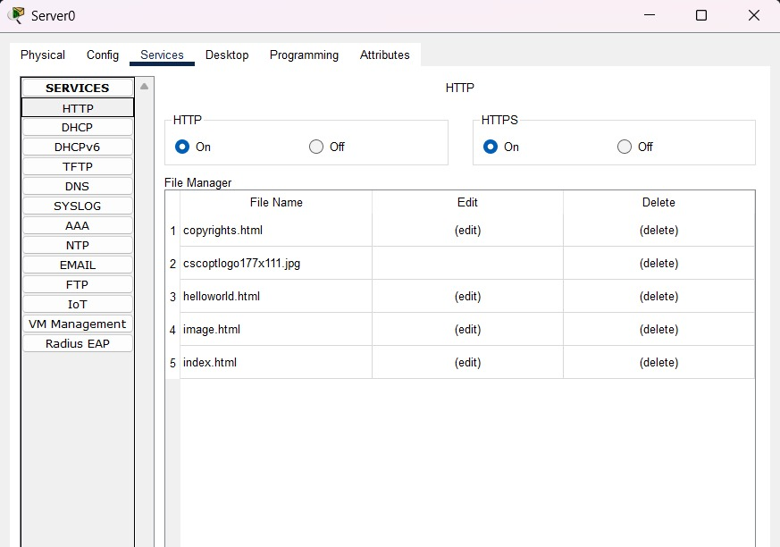

 ```
<!doctype html>
<html lang="es">
<head>
  <meta charset="utf-8">
  <title>Entretenimiento a bordo</title>
  <meta name="viewport" content="width=device-width,initial-scale=1">
  <style>
    :root{--bg:#0c1222;--fg:#eaf0ff;--mut:#9fb0c8;--tur:#2e86ff;--biz:#00b894;--adm:#c56cf0;--card:#121a2c}
    *{box-sizing:border-box} body{margin:0;background:linear-gradient(#0b1328,#0e1530);color:var(--fg);font:16px/1.5 system-ui,Segoe UI,Roboto,Arial}
    header{padding:42px 16px;text-align:center}
    h1{margin:0;font-size:36px}
    .sub{color:var(--mut);margin-top:6px}
    .wrap{max-width:900px;margin:18px auto;padding:0 16px}
    .panel{display:none;background:linear-gradient(180deg,var(--card),#0f182a);border:1px solid #243353;border-radius:14px;padding:18px;box-shadow:0 10px 30px rgba(0,0,0,.25)}
    .badge{display:inline-block;padding:6px 10px;border-radius:999px;font-weight:700;letter-spacing:.4px;text-transform:uppercase;margin-bottom:10px}
    .tur .badge{background:color-mix(in srgb,var(--tur) 25%, #000);color:#cfe1ff;border:1px solid color-mix(in srgb,var(--tur) 60%, #000)}
    .biz .badge{background:color-mix(in srgb,var(--biz) 25%, #000);color:#d9fff3;border:1px solid color-mix(in srgb,var(--biz) 60%, #000)}
    .adm .badge{background:color-mix(in srgb,var(--adm) 25%, #000);color:#f3e3ff;border:1px solid color-mix(in srgb,var(--adm) 60%, #000)}
    h2{margin:4px 0 8px}
    ul{margin:8px 0 0 18px;color:var(--mut)}
    .active{display:block}
    .hint{margin-top:10px;color:#7f8aa6;font-size:13px}
  </style>
</head>
<body>
  <header>
    <h1>Entretenimiento a bordo</h1>
    <div class="sub">Contenido y conectividad según tu clase.</div>
  </header>

  <div class="wrap">
    <section id="turista" class="panel tur">
      <span class="badge">Clase Turista</span>
      <h2 style="color:var(--tur)">Plan Esencial</h2>
      <ul>
        <li>Películas y series en SD</li>
        <li>Música y podcasts</li>
        <li>Juegos básicos</li>
        <li>Acceso al portal local (Internet bloqueado por política)</li>
      </ul>
    </section>

    <section id="business" class="panel biz">
      <span class="badge">Clase Business</span>
      <h2 style="color:var(--biz)">Plan Premium</h2>
      <ul>
        <li>Películas y series en HD</li>
        <li>Wi‑Fi con prioridad de ancho de banda</li>
        <li>Videollamadas y trabajo online</li>
        <li>Acceso completo al portal y servidor local</li>
      </ul>
    </section>

    <section id="admin" class="panel adm">
      <span class="badge">Clase Admin</span>
      <h2 style="color:var(--adm)">Acceso Total</h2>
      <ul>
        <li>Todo el contenido (SD/HD/4K)</li>
        <li>Herramientas de monitoreo y diagnóstico</li>
        <li>Gestión de red y soporte</li>
        <li>Salida completa a Internet</li>
      </ul>
    </section>

    <p class="hint">Abrí: turista.vuelo, business.vuelo o admin.vuelo (o usa ?clase=turista|business|admin).</p>
  </div>

  <script>
    function getClase(){
      const q = new URLSearchParams(location.search).get('clase');
      if (q) return q.toLowerCase();
      const h = location.hostname.toLowerCase();
      if (h.includes('business')) return 'business';
      if (h.includes('admin')) return 'admin';
      return 'turista';
    }
    const clase = getClase();
    const id = {turista:'turista', business:'business', admin:'admin'}[clase] || 'turista';
    document.getElementById(id).classList.add('active');
    document.title = `Entretenimiento - ${id[0].toUpperCase()+id.slice(1)}`;
  </script>
</body>
</html>
 ```


 ## CONFIGURACION DE LAPTOPS TURISTA, BUSINESS Y ADMIN


 ## COMPROBACION DE PING TURISTA


 ## COMPROBACION DE PING BUSINESS


 ## COMPROBACION DE PING ADMIN


 ## SIMULACION


 ## ACCESO A WEB DE LAS CLASES


## CONCLUSION

- Se logró la segmentación por VLAN (Turista/Business/Admin/Servidor) y el enrutamiento VLAN con router.
- DHCP y DNS operativos; los clientes obtienen IP/GW correctos y resuelven los hostnames del portal.
NAT y ruta por defecto en AIRCRAF permiten salida a Internet; Business y Admin navegan, Turista queda bloqueado por ACL.
- El servidor de entretenimiento responde por HTTP y muestra la vista según la clase; las pruebas de ping/HTTP coinciden con la matriz del TP.
- La topología quedó clara, reproducible y escalable para agregar más redes o políticas.
