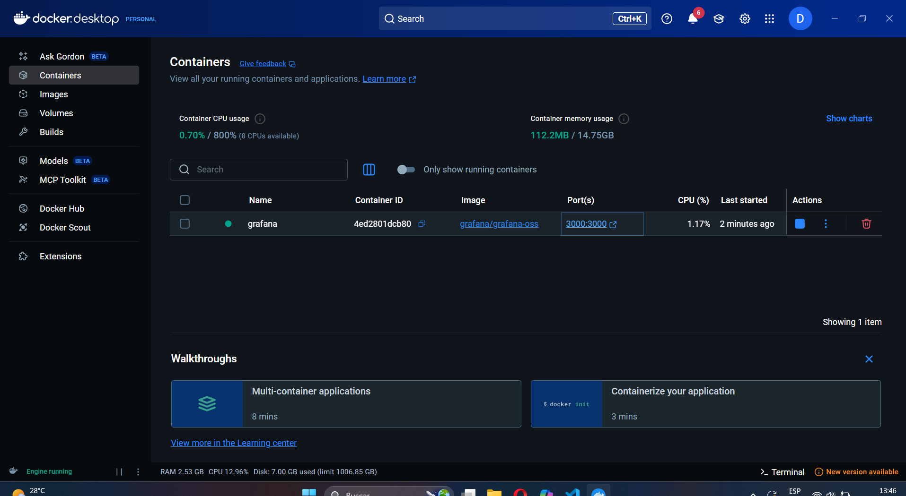
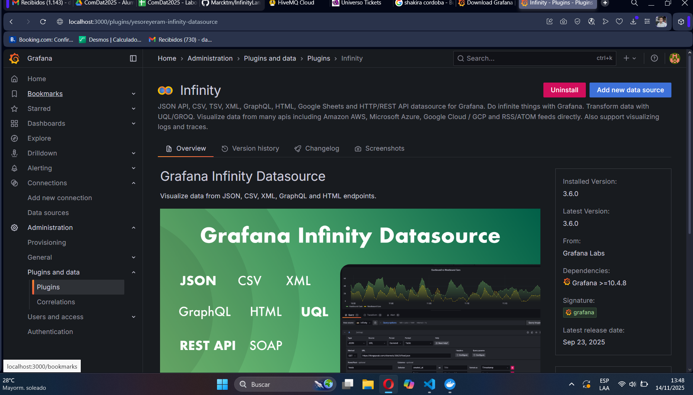
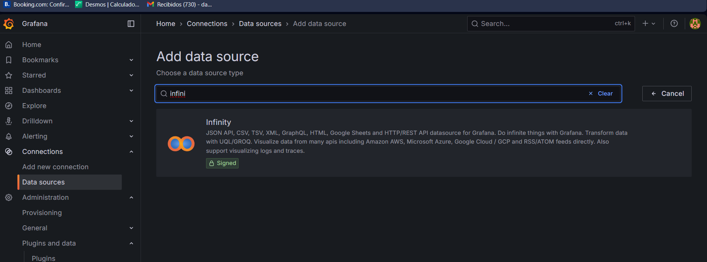

# 1. 

MQTT es un protocolo de comunicación ligero diseñado específicamente para dispositivos IoT y aplicaciones que requieren una transmisión eficiente de mensajes en redes con ancho de banda limitado. A diferencia de los modelos cliente-servidor tradicionales, MQTT utiliza un patrón Publish/Subscribe que permite comunicación desacoplada entre dispositivos.

---

##  Características del Protocolo MQTT

- **Protocolo Ligero:** Overhead mínimo (solo 8 bytes en la cabecera fija), ideal para dispositivos con recursos limitados.
- **Basado en TCP/IP:** Utiliza conexiones TCP para garantizar la entrega de mensajes.
- **Broker-Centric:** Todos los mensajes pasan por un broker central que actúa como intermediario entre publicadores y suscriptores.
- **Topicos Jerárquicos:** Los mensajes se organizan en temas usando separadores `/` (ej: `casa/salon/temperatura`, `auto/velocidad`).
- **Credentials Simples:** Soporta autenticación básica con usuario y contraseña.

---

##  Ventajas de MQTT

1. **Bajo Consumo de Ancho de Banda:** Ideal para redes con limitaciones (celular, IoT, satelital).
2. **Comunicación Asincrónica:** Publicadores y suscriptores no necesitan estar conectados simultáneamente.
3. **Escalabilidad:** Un broker puede manejar miles de clientes sin problemas.
4. **Desacoplamiento:** Los publicadores no necesitan conocer a los suscriptores y viceversa.
5. **Bajo Acoplamiento Temporal:** Perfecto para sistemas distribuidos y dispositivos móviles.

---

##  Desventajas de MQTT

1. **Dependencia del Broker:** Si el broker cae, la comunicación se interrumpe.
2. **Seguridad Limitada:** La autenticación básica requiere capas adicionales (TLS/SSL) para producción.
3. **No es Compatible con HTTP:** Requiere clientes y servidores específicos para MQTT.
4. **Complejidad en Sistemas Grandes:** Configurar clustering y alta disponibilidad requiere soluciones avanzadas.

---

## El Patrón Publish/Subscribe (Pub/Sub)
El patrón Pub/Sub es un modelo de comunicación basado en **eventos** donde:

- **Publicadores:** Envían mensajes a un tema específico sin saber quién los recibe.
- **Suscriptores:** Se registran en temas de interés y reciben automáticamente los mensajes publicados.
- **Broker:** Actúa como intermediario, almacenando temas y enrutando mensajes.

###  Diferencia con Modelo Cliente-Servidor Tradicional

| Aspecto | Modelo Cliente-Servidor | Modelo Pub/Sub |
|--------|------------------------|-----------------|
| **Acoplamiento** | Fuerte (cliente conoce servidor) | Débil (desacoplado) |
| **Comunicación** | Sincrónica  | Asincrónica |
| **Escalabilidad** | Uno-a-Uno | Muchos-a-Muchos |
| **Intermediario** | No (contacto directo) | Sí (broker obligatorio) |
| **Flexibilidad** | Baja | Alta |

---

# 2.

HiveMQ Cloud se trabaja en la nube sin isntalar nada.
me voy a: https://www.hivemq.cloud/

crear cuenta, y luego crear cruster
---

---
 
---

---

# 3.
---
 ```
cd "c:\Users\dario\OneDrive\Desktop\comDatosTP\tp5"
python simulador_mqtt_local.py
 ```
 --

--


# 4.

punto a:
 ```
cd "c:\Users\dario\OneDrive\Desktop\comDatosTP\tp5"
python punto4a_deviceA_deviceB.py
 ```
---


---

punto b:
 ```
python punto4b_broadcasting.py
 ```
---


--
# 5 
 ```
python punto5_sensores_jerarquia.py   
 ```
 ---
 


# monitoreae datos:

---

---

---


# 5. preguntass:

## a) ¿Sobre qué protocolos de capa de transporte están trabajando en esta actividad?
En esta actividad se utiliza principalmente el protocolo TCP en la capa de transporte, ya que MQTT funciona sobre TCP para garantizar la entrega ordenada y confiable de los mensajes entre clientes y el broker.

## b) ¿Qué pueden decir sobre la garantía de Integridad, Confidencialidad y Disponibilidad en esta arquitectura?

Integridad: TCP y MQTT aseguran que los mensajes lleguen completos y sin alteraciones, pero no protegen contra modificaciones maliciosas si no se usa cifrado.
Confidencialidad: Por defecto, los mensajes MQTT no están cifrados; para garantizar confidencialidad se debe usar TLS/SSL.
Disponibilidad: Depende de la estabilidad del broker y la red. Si el broker central falla, la comunicación se interrumpe.
# c) ¿Qué rol juegan los niveles de QoS en la fiabilidad de los mensajes?
Los niveles de QoS (Quality of Service) en MQTT determinan la garantía de entrega:

QoS 0: Entrega “al menos una vez”, sin confirmación.
QoS 1: Entrega “al menos una vez”, con confirmación.
QoS 2: Entrega “exactamente una vez”, con doble confirmación.
Esto permite ajustar la fiabilidad según la importancia del mensaje.
# d) ¿Qué ventajas ofrece el modelo pub/sub frente al modelo cliente-servidor?

Desacopla emisores y receptores (no necesitan conocerse).
Permite escalabilidad y flexibilidad.
Facilita la comunicación de muchos a muchos.
Reduce la carga en los clientes, centralizando la gestión en el broker.
# e) ¿Qué limitaciones tiene MQTT respecto a una red LAN real?

Depende de un broker central, lo que puede ser un punto único de fallo.
No está diseñado para transmisión de grandes volúmenes de datos.
Puede tener latencia adicional por el paso por el broker.
Requiere configuración y mantenimiento del broker.

# f) ¿Qué implicaciones tiene depender de un broker central para la comunicación?

Si el broker falla, toda la comunicación se detiene.
Puede ser un objetivo de ataques o sobrecarga.
Es necesario asegurar alta disponibilidad y respaldo del broker.
Centraliza la gestión y control de los mensajes, lo que puede ser ventajoso para monitoreo, pero riesgoso si no se gestiona bien.
